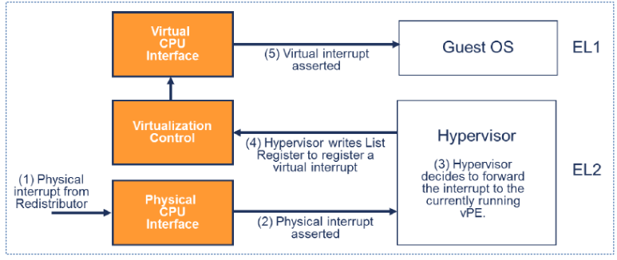
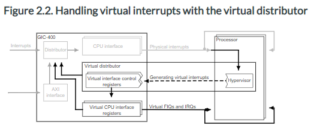

# 2021-08-17 (interrupt virtualization)

http://events17.linuxfoundation.org/sites/events/files/slides/ARM_Interrupt_Virtualization_Przywara.pdf

https://developpaper.com/original-kvm-qemu-analysis-of-linux-virtualization-2-armv8-virtualization/

> 1. Peripheral trigger interrupt signal to GIC;
> 2. GIC generates physical interrupt`IRQ`perhaps`FIQ`Signal, if set`HCR_EL2.IMO/FMO`The interrupt signal will be routed to`Hypervisor`，`Hypervisor`It checks to which interrupt signal is forwarded`vCPU`；
> 3. `Hypervisor`Set GIC to send the physical interrupt signal to a virtual interrupt`vCPU`If the processor is running at EL2, the interrupt signal will be ignored;
> 4. `Hypervisor`Return control to`vCPU`;
> 5. When the processor runs on el0 / el1, the virtual interrupt will be accepted and processed
>
> - The interrupt mask of armv8 processor is controlled by`PSTATE`To control (e.g`PSTATE.I`）In virtualization, the role of bits is somewhat different, such as setting`HCR_EL2.IMO`Indicates that the physical IRQ is routed to EL2 and turned on for el0 / el1`vIRQs`Therefore, when running at el0 / el1,`PSTATE.I`Bits are for virtual`vIRQs`Not physical`pIRQs`。

http://jake.dothome.co.kr/ic/

> #### 2-3) GICH, Virtual CPU Interface Control Registers
>
> - GICH_APR (Active Priorities Register)
> - GICH_EISRn (End of Interrupt Status Registers)
> - GICH_ELRSRn (Empty List Register Status Registers)
> - GICH_HCR (Hypervisor Control Register)
> - GICH_LRn (List Registers)
> - GICH_MISR (Maintenance Interrupt Status Register)
> - GICH_VMCR (Virtual Machine Control Register)
> - GICH_VTR (VGIC Type Register)

https://developer.arm.com/documentation/ddi0471/b/functional-description/functional-overview-of-the-gic-400/virtual-cpu-interfaces-and-virtual-interface-control-registers

CoreLink GIC-400 Generic Interrupt Controller Technical Reference Manual

https://developer.arm.com/documentation/ihi0048/b/GIC-Support-for-Virtualization/About-implementing-a-GIC-in-a-system-with-processor-virtualization

ARM Generic Interrupt Controller Architecture Specification

Q. 가상 인터럽트로 linux kernel에게 전달해준다면, linux kernel에서 gic 레지스터를 접근할 것 같은데, 이때 문제가 없는지? 어떤 식으로 처리되게 되는지?