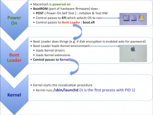

# 2021-05-15 (Apple Booting)

### Apple Booting Sequence

[그림 출처] https://osxdaily.com/2018/08/25/visualizing-mac-startup-boot-process/

[그림 출처] https://busylog.net/mac-osx-boot-sequence-launchd/

### Apple MacOS

소스코드가 공개되어있다.

https://opensource.apple.com/

### Apple Bootloader

Bootx (예전 Apple Bootloader) 에서 지금은 iBoot 를 사용한다.

(https://en.wikipedia.org/wiki/IBoot)

(https://support.apple.com/fr-ma/guide/security/secb3000f149/1/web/1)

Bootx 코드는 찾을 수 있었는데, iBoot 코드는 공개되지 않는다. (https://www.slashgear.com/ios-iboot-bootloader-source-code-leaked-on-github-08518701/)

Bootx 코드

- 압축 파일: https://opensource.apple.com/tarballs/BootX/

- Github: https://github.com/apple-opensource-mirror/BootX

부팅시 efi 를 사용한다고 해서 찾아보니 efi 정보가 담긴 header도 볼 수 있었다.

https://opensource.apple.com/source/xnu/xnu-2050.9.2/pexpert/pexpert/i386/efi.h.auto.html

더 상위의 폴더는 여기서 구경하면 된다.

https://opensource.apple.com/source/xnu/xnu-2050.9.2/pexpert/

