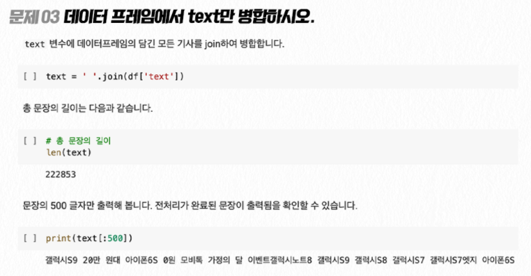

# 2021-07-31 (Python Deep Learning Guide)

### 파이썬 딥러닝 공부

파이썬으로 딥러닝을 공부하는 강좌 소개 페이지인데, 여기 적힌 목차들이 좋은 가이드가 될 수 있을 것 같아서 정리해두고자한다.

https://fastcampus.co.kr/data_online_dl300?gclid=CjwKCAjwzruGBhBAEiwAUqMR8C0ZXc2aXD9cOg96NJmeHH0_p8mTBQoMT_t67zJWBqZzHYpWjajjpBoCYQkQAvD_BwE

### 문제 예시

문제 풀이식으로 수업이 진행되는데, 문제 예시는 다음과 같다.

### 실습 주제

실습 구성은 다음과 같다. 요즘 뜨는 기술에는 ★ 로 표시하였다.

1. 손글씨 데이터
2. 딥페이크 ★
3. 이미지 분류
4. 영상 처리 ★
5. 텍스트 번역 ★
6. 화소 복원 ★
7. 노이즈 제거
8. 배경 제거
9. 칼라 복원
10. 흑백 변환
11. 이미지 생성 ★
12. 얼굴 인식 ★
13. 객체 인식 ★
14. 초해상도 ★
15. 용량 축소
16. 이미지 변환
17. 이미지 편집
18. 다객체 분류
19. 이미지 모핑 ★
20. 객체 추출 ★
21. 자연어 처리 ★
22. 위드덤베팅 ★
23. 형태소 분석
24. AI 봇

### 파이썬 라이브러리

사용하는 라이브러리는 다음과 같다.

PyTorch, Tensorflow, Keras, Pandas, Numpy, Matplotlib, Seaborn, YOLO v5, Konlpy, Gensim, NLTK, FaceForensic++, StyleGAN v2, Image2StyleGAN, OpenDartRender

### 커리큘럼

수업 목차는 다음과 같다.

### Intro. 딥러닝 시작하기

**Ch1. 딥러닝 소개**

- 딥러닝이란?

- 딥러닝의 원리
- 딥러닝이 주로 다루는 문제들

**Ch2. 딥러닝의 원리**

- 딥러닝의 구조
- 비용 함수
- 경사하강법

**Ch3. 딥러닝 공부법**

- 딥러닝 라이브러리
- 딥러닝을 제대로 공부하는 법

### Part 1. 이미지 분류 기초

**Ch1. RNN으로 손글씨 이미지 분류하기**

[Step 0] 기초지식 개요: RNN 분류의 특색

[Step 1] 도입전 기본 처리
- 문제 01. mnist 데이터 살펴보기
- 문제 02. 데이터의 shape을 출력하세요
- 문제 03. (28, 28) 형태의 이미지를 plt을 이용하여 출력해보세요
- 문제 04. train_images에서 0이 아닌 값들을 출력해보세요
- 문제 05. train_images의 dtype을 출력해보세요

[Step 2] 전처리
- 문제 06. train/test 이미지 데이터의 범위 확인
- 문제 07. train/test 이미지 데이터의 최소/최대값을 출력
- 문제 08. 정수형을 실수형으로 변경 후 dtype으로 비교
- 문제 09. 데이터 노말라이즈 수행
- 문제 10. 노말라이즈 후 데이터의 값이 변경되었는지 확인하세요

[Step 3] 시각화 방법
- 문제 11. train_image의 이미지를 5장 획득하여 (5, 28, 28)의 shape을 출력하세요
- 문제 12. 획득한 5장의 의미지를 (28, 28 * 5)의 shape으로 변경해보세요
- 문제 13. transpose 함수를 이용하여 (28, 28 * 5)로 shape을 변경해보세요
- 문제 14. (28, 140)이 된 tensor를 plt로 출력해보세요
- 문제 15. (28, 140)이 된 tensor를 plt로 흑백으로 출력하고 labels의 값도 print로 출력하세요

[Step 4] 데이터 Augmentation
- 문제 16. np.random.random 함수를 이용하여 0과 1 사이의 랜덤값을 3회 출력하세요
- 문제 17. np.random.random 함수와 shape parameter를 이용해 (28, 28)의 랜덤 노이즈를 생성하세요
- 문제 18. 생성된 random (28, 28) 노이즈를 plt를 통하여 확인해보세요
- 문제 19. 가우시안 노이즈 함수를 사용하여 평균 0, 표준편차 0.1, 사이즈 1로 랜덤 값을 3번 출력하세요
- 문제 20. 가우시안 노이즈 함수의 옵션을 문제 17과 동일하지만 평균이 3.0인 경우, 표준 편차가 0.01인 경우로 각각 3회씩 출력해보세요
- 문제 21. 가우시안 노이즈 함수를 문제 17의 옵션으로 size를 (28, 28)로 생성 후 plt로 출력해보세요
- 문제 22. train_images의 5번째 이미지와 가우시안 노이즈 (28, 28)를 생성 한 뒤 각각 tensor를 더한 뒤 noisy_image 변수에 할당 해보세요
- 문제 23. noisy_image를 plt를 통해서 출력해보세요
- 문제 24. noisy image를 생성했지만, max가 1이 넘습니다. max값을 1로 조절해보세요
- 문제 25. 위의 방법을 전부 활용하여 train_images와 test_images 데이터에 랜덤 노이즈를 추가한 train_noisy_images와 test_noisy_images를 생성해보세요
- 문제 26. labels에 onehot 인코딩을 적용하여 (배치 사이즈, 클래스 개수)의 shape으로 변경해보세요

[Step 5] 딥러닝 모델링
- 문제 27. 해당 학습셋을 처리하는 이미지 classificaion 모델을 작성하세요
- 문제 28. 모델 요약 정보를 출력해보세요
- 문제 29. 모델에 로스와 옵티마이저, 메트릭을 설정하세요
- 문제 30. 모델에 train_noisy_images를 학습시켜 보세요
- 문제 31. 학습 진행 사항을 plt으로 출력하세요

[Step 6] 모델 학습 결과 확인
- 문제 32. 완성된 모델에서 test_noisy_image를 1장 넣고 결과를 res 변수에 저정하세요
- 문제 33. test_noisy_images[0], test_images[0]를 width 방향으로 결합하여 plt로 출력하세요
- 문제 34. res와 test_labels[0]의 결과를 plt.bar로 확인하세요

[Step 7] 모델 저장 및 로드, 다운
- 문제 35. 모델을 저장하세요
- 문제 36. 모델 파일을 새로운 모델에 로드하세요
- 문제 37. 로드한 모델을 test 데이터로 평가해보세요
- 문제 38. 모델을 내 컴퓨터에 저장해보세요

**Ch2. 인물 사진에서 성별과 표정 분석하기**

[Step 0] 기초지식 개요: 멀티 아웃풋 모델

[Step 1] 도입전 기본 처리
- 문제 01. tfds를 이용하여 데이터셋 사용하기
- 문제 02. celeba의 정보중 이용할 데이터만 추출하세요
- 문제 03. 데이터 용량을 축소하세요
- 문제 04. 사전 저장된 celeba small 데이터 확인해보세요
- 문제 05. celeba_small 데이터를 살펴보세요
- 문제 06. x와 y의 shape을 출력해보세요
- 문제 07. x, y를 각각 plt를 통하여 출력하세요
- 문제 08. celeba_small.npz 데이터에서 학습, 테스트 데이터를 로드하세요
- 문제 09. train_images에서 0이 아닌 값들을 출력해보세요
- 문제 10. train_images의 dtype을 출력해보세요

[Step 2] 데이터 전처리
- 문제 11. 이미지 데이터의 범위 확인
- 문제 12. images/labels 이미지 데이터의 최소/최대값을 출력하세요
- 문제 13. labels의 shape을 (배치, 2)에서 (배치, 2), (배치, 2)으로 변경하세요. (배치, (성별,웃음)) => (배치, 남자, 여자), (배치, 웃음, 안웃음)
- 문제 14. labels의 shape을 (배치, 2), (배치, 2)에서 (배치, 4)로 합쳐보세요

[Step 3] 데이터 시각화
- 문제 15. train_image의 이미지를 5장 획득하여 (5, 세로, 가로, 3)의 shape을 출력하세요
- 문제 16. 획득한 5장의 의미지를 (세로, 가로 * 5, 3)의 shape으로 변경해보세요
- 문제 17. transpose 함수를 이용하여 (세로, 가로 * 5, 3)로 shape을 변경해보세요
- 문제 18. (72, 295, 3)이 된 tensor를 plt로 출력해보세요
- 문제 19. smile, male label도 5개 출력해보세요
- 문제 20. smile, male이 각각 몇개 있는지 측정해보세요

[Step 4] 딥러닝 모델링
- 문제 21. smile과 gender 학습셋을 각 각 처리하는 이미지 classification 모델 2개를 작성하세요. (단 label을 각각 따로 처리)
- 문제 22. 2개의 모델을 할당 받고 요약 정보를 출력해보세요
- 문제 23. 만든 모델에 로스와 옵티마이저, 메트릭을 설정하세요
- 문제 24. 만든 모델에 train_images를 학습시켜 보세요
- 문제 25. 학습 진행 사항을 plt으로 출력하세요

[Step 5] 모델 학습 결과 확인
- 문제 26. 완성된 모델에서 test_image를 1장 넣고 결과를 res 변수에 저정하세요
- 문제 27. res와 test_images[1]을 plt로 출력하세요

[Step 6] 멀티 아웃풋 모델링
- 문제 28. 해당 학습셋을 처리하는 이미지 classification 모델을 작성하세요. (단 label을 2개 동시에 처리)
- 문제 29. 모델을 할당 받고 요약 정보를 출력해보세요
- 문제 30. 만든 모델에 로스와 옵티마이저, 메트릭을 설정하세요
- 문제 31. 만든 모델에 train_images를 학습시켜 보세요
-문제 32. 학습 진행 사항을 plt으로 출력하세요

[Step 7] 멀티 아웃풋 모델 결과 확인
- 문제 33. 완성된 모델에서 test_image를 1장 넣고 결과를 res 변수에 저정하세요
- 문제 34. res와 test_images[1]을 plt로 출력하세요

[Step 8] 모델 분리
- 문제 35. model의 뒷단을 수정하여 성별 모델을 분리해보세요
- 문제 36. 성별모델에서 테스트 데이터 확인
- 문제 37. 통합 모델에서 스마일 모델을 분리해보세요
- 문제 38. 스마일 모델에서 테스트 데이터를 확인해보세요

[Step 9] 통합 모델 저장 및 로드, 다운
- 문제 39. 모델을 저장하세요
- 문제 40. 모델 파일을 새로운 모델에 로드하세요
- 문제 41. 로드한 모델을 test 데이터로 평가해보세요
- 문제 42. 모델을 내 컴퓨터에 저장해보세요

**Ch3. 여러 의상 사진에서 옷 종류 구분하기**

[Step 0] 기초지식 개요: 멀티레이블 분류란?

[Step 1] 도입전 기본 처리
- 문제 01. fashion mnist 데이터 살펴보기
- 문제 02. train_images/labels와 test_images/labes의 shape을 출력해보세요
- 문제 03. (28, 28) 형태의 이미지를 plt을 이용하여 출력해보세요
- 문제 04. train_images에서 0이 아닌 값들을 출력해보세요
- 문제 05. train_images의 dtype을 출력해보세요

[Step 2] 데이터 전처리
- 문제 06. train/test 이미지 데이터의 범위 확인
- 문제 07. train/test 이미지 데이터의 최소/최대값을 출력
- 문제 08. 정수형을 실수형으로 변경 후 dtype으로 비교
- 문제 09. 데이터 노말라이즈 수행
- 문제 10. 노말라이즈 후 데이터의 값이 변경되었는지 확인하세요

[Step 3] 데이터 시각화
- 문제 11. train_image의 이미지를 5장 획득하여 (5, 28, 28)의 shape을 출력하세요
- 문제 12. 획득한 5장의 의미지를 (28, 28 * 5)의 shape으로 변경해보세요
- 문제 13. transpose 함수를 이용하여 (28, 28 * 5)로 shape을 변경해보세요
- 문제 14. (28, 140)이 된 tensor를 plt로 출력해보세요

[Step 4] 데이터 Augmentation
- 문제 15. 이미지 한장의 크기를 4배로 확대하고, 객체는 4분면 영역중 랜덤으로 1공간에 넣는 함수를 작성하여보세요
- 문제 16. 4배 이미지 변환을 전체 train/test 데이터에 실행하여 train_expend_images, test_expend_images를 생성하세요
- 문제 17. 4배 이미지 변환 함수를 수정하여 이미지 사이즈를 4배 확대 시킨 뒤, 객체를 랜덤으로 0~4개, 랜덤 4분면에 위치시키는 함수를 작성하세요
- 문제 18. 4배 이미지 변환을 전체 train/test 데이터에 실행하여 train_multi_images, test_multi_images, train_multi_labels, train_multi_labels를 생성하세요
- 문제 19. multi labels와 train_labels의 값의 형태를 비교해보세요
- 문제 20. train_labels에서 label들의 분포를 구해보세요
- 문제 21. multi labels에서 label들의 분포와 평균 사진 개수 분포를 구하세요

[Step 5] 딥러닝 모델링
- 문제 22. train_expand_images, train_labels로 초벌 모델을 생성해보세요
- 문제 23. 모델을 할당 받고 서머리를 출력해보세요
- 문제 24. 만든 모델에 로스와 옵티마이저, 메트릭을 설정하세요
- 문제 25. 만든 모델에 train_expand_images를 학습시켜 보세요
- 문제 26. 학습 진행 사항을 출력하세요

[Step 6] 모델링 결과 확인
- 문제 27. 완성된 모델에서 test_expand_images를 1장 넣고 결과를 res 변수에 저정하세요
- 문제 28. res의 결과와 실제 label을 비교하고 test_exnpand_images[0]을 plt로 출력하세요

[Step 7] 멀티 레이블 모델링
- 문제 29. train_multi_images 와 train_multi_labels를 처리 할 수 있는 모델을 작성하세요
- 문제 30. 기존 모델을 멀티 모델로 변환하여 모델 서머리를 출력하세요
- 문제 31. 문제 25과 같은 세팅으로 train_multi_images를 학습시키세요
- 문제 32. 완성된 모델에서 test_multi_images를 1장 넣고 결과를 res 변수에 저정한뒤 실제 test_multi_labels와 비교해보세요

[Step 8] 모델 저장 및 로드, 다운
- 문제 33. 모델을 저장하세요
- 문제 34. 모델 파일을 새로운 모델에 로드하세요
- 문제 35. 로드한 모델을 test 데이터로 평가해보세요
- 문제 36. 모델을 내 컴퓨터에 저장해보세요

### Part 2. 이미지 변형 기초

**Ch1. 손상된 의류 이미지 화질 복구하기**

[Step 0] 기초지식 개요: 오토인코더

[Step 1] 도입전 기본 처리
- 문제 01. fashion mnist 데이터 살펴보기
- 문제 02. 데이터의 shape을 출력
- 문제 03. 하나의 배열을 plt를 통하여 출력
- 문제 04. 이미지 데이터에서 0이 아닌 값을 출력하기
- 문제 05. 데이터의 dtype을 출력하기

[Step 2] 데이터 전처리
- 문제 06. train/test 이미지 데이터의 범위 확인
- 문제 07. train/test 이미지 데이터의 최소/최대값을 출력
- 문제 08. 정수형을 실수형으로 변경 후 dtype으로 비교
- 문제 09. 데이터 노말라이즈 수행
- 문제 10. 노말라이즈 후 데이터의 값이 변경되었는지 확인하세요
- 문제 11. 흑백 이미지를 칼라 이미지의 shape으로 변경하세요

[Step 3] 데이터 시각화
- 문제 12. train_image의 이미지를 5장 획득하여 (5, 28, 28, 3)의 shape을 출력하세요
- 문제 13. 획득한 5장의 의미지를 (28, 28 * 5, 3)의 shape으로 변경해보세요
- 문제 14. transpose 함수를 이용하여 (28, 28 * 5, 3)로 shape을 변경해보세요
- 문제 15. (28, 140, 3)이 된 tensor를 plt로 출력해보세요

[Step 4] 데이터 Augmentation
- 문제 16. np.random.random 함수를 이용하여 0과 1 사이의 랜덤값을 3회 print로 출력해보시오
- 문제 17. np.random.random 함수와 shape parameter를 활용하여 (28, 28. 3)의 칼라 랜덤 노이즈를 생성해보세요
- 문제 18. 생성된 random (28, 28, 3) 노이즈를 plt를 통하여 확인해보세요
- 문제 19. 가우시안 노이즈 함수를 사용하여 평균 0, 표준편차 0.1, 사이즈 1로 랜덤 값을 3번 출력하세요. (np.random.normal)
- 문제 20. 가우시안 노이즈 함수를 사용하여 평균 3.0인 경우, 표준 편차가 0.01인 경우로 각각 3회씩 출력해보세요
- 문제 21. 가우시안 노이즈 함수를 size를 (28, 28, 3)로 생성 후 plt로 출력해보세요(범위는 0-1의 사이로 고정)
- 문제 22. train_images의 5번째 이미지와 가우시안 노이즈 (28, 28, 3)를 생성 한 뒤 각각 tensor를 더한 뒤 noisy_image 변수에 할당 해보세요
- 문제 23. noisy_image를 plt를 통해서 출력해보세요
- 문제 24. 위의 방법을 전부 활용하여 train_images와 test_images 데이터에 랜덤 노이즈를 추가한 train_noisy_images와 test_noisy_images를 생성해보세요
- 문제 25. 노이즈가 추가된 train_noisy_images에서 5장을 plt으로 출력해보세요

[Step 5] 딥러닝 모델링
- 문제 26. 해당 학습셋을 처리하는 이미지 classificaion 모델을 작성하세요
- 문제 27. 모델 요약 정보를 출력해보세요
- 문제 28. 만든 모델에 로스와 옵티마이저, 메트릭을 설정하세요
- 문제 29. 만든 모델에 train_noisy_images를 학습시켜 보세요
- 문제 30. 학습 진행 사항을 plt으로 출력하세요

[Step 6] 모델 학습 결과 확인
- 문제 31. 완성된 모델에서 test_noisy_image를 1장 넣고 결과를 res 변수에 저정하세요
- 문제 32. res와 test_noisy_images[0], test_images[0]를 width 방향으로 결합하여 plt로 출력하세요
- 문제 33. 5장의 test_noisy_images를 모델에 넣은 뒤 결과를 31번의 방식으로 비교하세요

[Step 7] 모델 저장 및 로드, 다운
- 문제 34. 모델을 저장하세요
- 문제 35. 모델 파일을 새로운 모델에 로드하세요
- 문제 36. 로드한 모델을 test 데이터로 평가해보세요
- 문제 37. 모델을 내 컴퓨터에 저장해보세요

**Ch2. 이미지 세그멘테이션 - 인물 사진에서 배경 없애기**

[Step 0] 기초지식 개요: 오토인코더 및 세그먼트

[Step 1] 도입전 기본 처리
- 문제 01. 구글 드라이브와 코렙 연동
- 문제 02. pfcn 데이터 살펴보기
- 문제 03. x와 y의 shape을 출력해보세요
- 문제 04. x, y를 각각 plt를 통하여 출력하세요
- 문제 05. (800, 600)의 의미지는 colab에서 돌리기에 너무 큽니다. (100, 75)로 이미지를 줄여보세요
- 문제 06. pfcn_small.npz 데이터에서 학습, 테스트 데이터를 로드하세요
- 문제 07. train_images에서 0이 아닌 값들을 출력해보세요
- 문제 08. train_images의 dtype을 출력해보세요

[Step 2] 데이터 전처리
- 문제 09. images/matters 이미지 데이터의 범위 확인
- 문제 10. images/matters 이미지 데이터의 최소/최대값을 출력
- 문제 11. mattes의 shape을 (배치, 100, 75, 3)에서 (배치, 100, 75, 1)으로 변경하세요

[Step 3] 데이터 시각화
- 문제 12. train_image의 이미지를 5장 획득하여 (5, 100, 75, 3)의 shape을 출력하세요
- 문제 13. 획득한 5장의 의미지를 (100, 75 * 5, 3)의 shape으로 변경해보세요
- 문제 14. (100, 375, 3)이 된 tensor를 plt로 출력해보세요
- 문제 15. mettes도 (100, 375)으로 plt로 출력해보세요

[Step 4] AE 모델링
- 문제 16. 해당 학습셋을 처리하는 이미지 segmentation 모델을 작성하세요
- 문제 17. 모델을 할당 받고 서머리를 출력해보세요
- 문제 18. 만든 모델에 로스와 옵티마이저, 메트릭을 설정하세요
- 문제 19. 만든 모델에 train_noisy_images를 학습시켜 보세요
- 문제 20. 학습 진행 사항을 plt으로 출력하세요

[Step 5] AE 모델 학습 결과 확인
- 문제 21. 완성된 모델에서 test_image를 1장 넣고 결과를 res 변수에 저정하세요
- 문제 22. test_images[1], test_mattes[1]를 width 방향으로 결합하여 plt로 출력하세요
- 문제 23. res에 0.5의 값을 기준으로 0과 1로 2원화 시키고 다시 문제 22처럼 출력해보세요
- 문제 24. 5장의 test_images를 모델에 넣은 뒤 결과를 문제 22 방식으로 비교하세요
- 문제 25. test_images[1]과 res를 곱한뒤 plt에 출력해보세요

[Step 6] Unet 모델링
- 문제 26. 해당 학습셋을 처리하는 이미지 segmentation 모델을 작성하세요
- 문제 27. 모델을 할당 받고 요약 정보를 출력해보세요
- 문제 28. 만든 모델에 로스와 옵티마이저, 메트릭을 설정하세요
- 문제 29. 만든 모델에 train_noisy_images를 학습시켜 보세요
- 문제 30. 학습 진행 사항을 plt으로 출력하세요

[Step 7] Unet 모델링 학습 결과 확인
- 문제 31. 완성된 모델에서 test_image를 1장 넣고 결과를 res 변수에 저정하세요
- 문제 32. test_images[1], test_mattes[1]를 width 방향으로 결합하여 plt로 출력하세요
- 문제 33. res에 0.5의 값을 기준으로 0과 1로 2원화 시키고 다시 문제 32처럼 출력해보세요
- 문제 34. 5장의 test_images를 모델에 넣은 뒤 결과를 문제 32 방식으로 비교하세요
- 문제 35. test_images[1]과 res를 곱한뒤 plt에 출력해보세요

[Step 8] 모델 저장 및 로드, 다운
- 문제 36. 모델을 저장하세요
- 문제 37. 모델 파일을 새로운 모델에 로드하세요
- 문제 38. 로드한 모델을 test 데이터로 평가해보세요
- 문제 39. 모델을 내 컴퓨터에 저장해보세요

**Ch3. 칼라 흑백 전환 - 칼라 사진을 흑백 사진으로 변경 하기**

[Step 0] 기초지식 개요: 오토인코더 및 colorization

[Step 1] 도입전 기본 처리
- 문제 01. 구글 드라이브와 코렙 연동하기
- 문제 02. pfcn 데이터 살펴보기
- 문제 03. x와 shape을 출력해보세요
- 문제 04. x를 plt를 통하여 출력하세요
- 문제 05. (800, 600)의 의미지는 colab에서 돌리기에 너무 큽니다. (100, 75)로 이미지를 줄여보세요
- 문제 06. pfcn_small.npz 데이터에서 학습, 테스트 데이터를 로드하세요.
- 문제 07. train_images에서 0이 아닌 값들을 출력해보세요
- 문제 08. train_images의 dtype을 출력해보세요.

[Step 2] 데이터 전처리
- 문제 09. images/matters 이미지 데이터의 범위 확인
- 문제 10. images/matters 이미지 데이터의 최소/최대값을 출력
- 문제 11. train_images와 test_images로 흑백인 train_gray_images, test_gray_images를 생성하세요

[Step 3] 데이터 시각화
- 문제 12. train_image의 이미지를 5장 획득하여 (5, 100, 75, 3)의 shape을 출력하세요
- 문제 13. 획득한 5장의 의미지를 (100, 75 * 5, 3)의 shape으로 변경해보세요
- 문제 14. (100, 375, 3)이 된 tensor를 plt로 출력해보세요

[Step 4] 딥러닝 모델링
- 문제 15. 칼라 이미지를 흑백으로 변환하는 모델을 작성하세요
- 문제 16. 모델을 할당 받고 요약 정보를 출력해보세요
- 문제 17. 만든 모델에 로스와 옵티마이저, 메트릭을 설정하세요
- 문제 18. 만든 모델에 train_images, train_gray_images를 학습시켜 보세요
- 문제 19. 학습 진행 사항을 plt으로 출력하세요

[Step 5] 모델 학습 결과 확인
- 문제 20. 완성된 모델에서 test_image를 1장 넣고 결과를 res 변수에 저정하세요
- 문제 21. res와 test_gray_images[1]를 width 방향으로 결합하여 plt로 출력하세요
- 문제 22. 5장의 test_images를 모델에 넣은 뒤 결과를 문제 21 방식으로 비교하세요

[Step 6] 더 간단한 모델링
- 문제 23. 칼라 이미지를 흑백으로 변환하는 모델을 작성하세요
- 문제 24. 모델을 할당 받고 서머리를 출력해보세요
- 문제 25. 만든 모델에 로스와 옵티마이저, 메트릭을 설정하세요
- 문제 26. 만든 모델에 train_images, train_gray_images를 학습시켜 보세요
- 문제 27. 학습 진행 사항을 plt으로 출력하세요

[Step 7] 모델 학습 결과 확인
- 문제 28. 완성된 모델에서 test_image를 1장 넣고 결과를 res 변수에 저정하세요
- 문제 29. res와 test_gray_images[1]를 width 방향으로 결합하여 plt로 출력하세요
- 문제 30. 5장의 test_images를 모델에 넣은 뒤 결과를 문제 21 방식으로 비교하세요

[Step 8] 극단적 선형 흑백 모델
- 문제 31. 극단적 선형 흑백 모델을 구현하세요
- 문제 32. res와 test_gray_images[1]를 width 방향으로 결합하여 plt로 출력하세요
- 문제 33. 5장의 test_images를 모델에 넣은 뒤 결과를 문제 21 방식으로 비교하세요

[Step 9] 모델 저장 및 로드, 다운
- 문제 34. 모델을 저장하세요
- 문제 35. 모델 파일을 새로운 모델에 로드하세요
- 문제 36. 로드한 모델을 test 데이터로 평가해보세요
- 문제 37. 모델을 내 컴퓨터에 저장해보세요

**Ch4. 흑백 칼라 전환 - 오래된 흑백 사진을 흐릿한 컬러 사진으로 복원하기**

[Step 0] 기초지식 개요: 오토인코더 및 colorization

[Step 1] 도입전 기본 처리

- 문제 01. 구글 드라이브와 코렙 연동하기
- 문제 02. pfcn 데이터 살펴보기
- 문제 03. x와 shape을 출력해보세요
- 문제 04. x를 plt를 통하여 출력하세요
- 문제 05. (800, 600)의 의미지는 colab에서 돌리기에 너무 큽니다. (100, 75)로 이미지를 줄여보세요
- 문제 06. pfcn_small.npz 데이터에서 학습, 테스트 데이터를 로드하세요
- 문제 07. train_images에서 0이 아닌 값들을 출력해보세요
- 문제 08. train_images의 dtype을 출력해보세요

[Step 2] 데이터 전처리
- 문제 09. images/matters 이미지 데이터의 범위 확인
- 문제 10. images/matters 이미지 데이터의 최소/최대값을 출력
- 문제 11. train_images와 test_images로 흑백인 train_gray_images, test_gray_images를 생성하세요

[Step 3] 데이터 시각화
- 문제 12. train_image의 이미지를 5장 획득하여 (5, 100, 75, 3)의 shape을 출력하세요
- 문제 13. 획득한 5장의 의미지를 (100, 75 * 5, 3)의 shape으로 변경해보세요
- 문제 14. (100, 375, 3)이 된 tensor를 plt로 출력해보세요
- 문제 15. gray도 (100, 375)으로 plt로 출력해보세요

[Step 4] 딥러닝 모델링
- 문제 16. 흑백 이미지를 칼라로 변환하는 모델을 작성하세요
- 문제 17. 모델을 할당 받고 요약 정보를 출력해보세요
- 문제 18. 만든 모델에 로스와 옵티마이저, 메트릭을 설정하세요
- 문제 19. 만든 모델에 train_images, train_gray_images를 학습시켜 보세요
- 문제 20. 학습 진행 사항을 plt으로 출력하세요

[Step 5] 모델 학습 결과 확인
- 문제 21. 완성된 모델에서 test_image를 1장 넣고 결과를 res 변수에 저정하세요
- 문제 22. res와 test_gray_images[1]를 width 방향으로 결합하여 plt로 출력하세요
- 문제 23. 5장의 test_images를 모델에 넣은 뒤 결과를 문제 29 방식으로 비교하세요

[Step 6] lab 칼라 모델링
- 문제 24. rgb 칼라를 lab 칼라로 바꿔보세요
- 문제 25. lab 칼라 이미지를 채널별로 최대, 최소 값을 출력해보세요
- 문제 26. lab 칼라는 채널별 최대값을 [0-100, 128-255, 128-255]로 가지고 있습니다. 0-1 노말라이즈 하세요
- 문제 27. lab 칼라의 이미지 하나를 고르고 첫번째 채널을 plt으로 출력해보세요
- 문제 28. lab 칼라 첫번째 채널로 나머지 2채널을 예측하는 모델을 작성하세요
- 문제 29. 모델을 할당 받고 요약 정보를 출력해보세요
- 문제 30. 만든 모델에 로스와 옵티마이저, 메트릭을 설정하세요
- 문제 31. 만든 모델에 train_lab_images[...,0], train_lab_images[...,1:]를 학습시켜 보세요
- 문제 32. 학습 진행 사항을 plt으로 출력하세요

[Step 7] lab 칼라 모델 학습 결과 확인
- 문제 33. 완성된 모델에서 test_image를 1장 넣고 결과를 res 변수에 저정하세요
- 문제 34. res와 test_gray_images[1]를 width 방향으로 결합하여 plt로 출력하세요
- 문제 35. 5장의 test_images를 모델에 넣은 뒤 결과를 문제 29 방식으로 비교하세요

[Step 8] 모델 저장 및 로드, 다운
- 문제 36. 모델을 저장하세요
- 문제 37. 모델 파일을 새로운 모델에 로드하세요
- 문제 38. 로드한 모델을 test 데이터로 평가해보세요
- 문제 39. 모델을 내 컴퓨터에 저장해보세요

**Ch5. 선명한 사진 확대 - 학종이만한 사진을 사진만한 크기로 확대하기**

[Step 0] 기초지식 개요: 오토인코더 및 colorization

[Step 1] 도입전 기본 처리
- 문제 01. pfcn 데이터 살펴보기
- 문제 02. x와 shape을 출력해보세요
- 문제 03. x를 plt를 통하여 출력하세요
- 문제 04. (800, 600)의 의미지는 colab에서 돌리기에 너무 큽니다. (100, 75)로 이미지를 줄여보세요
- 문제 05. (50, 37)로 이미지를 줄여보고 출력해보세요
- 문제 06. pfcn_small.npz 데이터에서 학습, 테스트 데이터를 로드하세요
- 문제 07. train_big_images, tset_big_images를 (50, 37, 3)으로 줄인 이미지를 할당하세요
- 문제 08. train_big_images에서 0이 아닌 값들을 출력해보세요
- 문제 09. train_big_images의 dtype을 출력해보세요

[Step 2] 데이터 전처리
- 문제 10. train/test_big_images 이미지 데이터의 범위 확인
- 문제 11. images 이미지 데이터의 최소/최대값을 출력

[Step 3] 데이터 시각화
- 문제 12. train_big_image의 이미지를 5장 획득하여 (5, 100, 75, 3)의 shape을 출력하세요
- 문제 13. transpose 함수를 이용하여 (100, 75 * 5, 3)로 shape을 변경해보세요
- 문제 14. (100, 375, 3)이 된 tensor를 plt로 출력해보세요
- 문제 15. small도 (50, 37 * 5, 3)으로 plt로 출력해보세요

[Step 4] 딥러닝 모델링
- 문제 16. small 학습셋을 big으로 고해상도 변경하는 모델을 작성하세요
- 문제 17. 모델을 할당받고 요약 정보를 출력하세요
- 문제 18. 만든 모델에 로스와 옵티마이저, 메트릭을 설정하세요
- 문제 19. 만든 모델에 train_small_images를 학습시켜 보세요
- 문제 20. 학습 진행 사항을 plt으로 출력하세요

[Step 5] 모델링 학습 결과 확인
- 문제 21. 완성된 모델에서 test_image를 1장 넣고 결과를 res 변수에 저정하세요
- 문제 22. test_small_images[1]을 resize 함수를 이용하여 (100, 75)으로 2배 확대시키세요
- 문제 23. res와 확대한 이미지, test_big_images[1]을 동시에 출력시켜 보세요
- 문제 24. 3장의 test_small_images를 모델에 넣은 뒤 결과를 문제 23 방식으로 비교하세요

[Step 6] 모델 저장 및 로드, 다운
- 문제 25. 모델을 저장하세요
- 문제 26. 모델 파일을 새로운 모델에 로드하세요
- 문제 27. 로드한 모델을 test 데이터로 평가해보세요
- 문제 28. 모델을 내 컴퓨터에 저장해보세요

### Part 3. 텍스트 분류 기초

**Ch1. 시계열 분석 - 딥러닝으로 Seq2Seq 계산기 만들기**

[Step 0] 기초지식 개요: Seq2Seq란?

[Step 1] 도입전 기본 처리
- 문제 01. 랜덤 2자리 더하기 데이터와 정답셋 생성

[Step 2] 데이터 전처리
- 문제 02. train_text, train_answer를 bow 형태로 변경하세요
- 문제 03. vacab의 역형태인 map 형태도 생성하세요
- 문제 04. train_text와 train_anser를 BOW 형태로 변경하세요

- 문제 05. train_bow_text와 train_bow_answer에 padding을 추가하여 완전한 np.array로 변경하세요
- 문제 06. train_bow_text를 train_data_bow, test_data_bow로 (98%, 2%의 개수) 분리해보세요

[Step 3] 데이터 시각화
- 문제 07. train_data_bow에서 등장하는 token의 분포를 출력해보세요
- 문제 08. train_answer_bow에서 등장하는 token의 분포를 출력해보세요

[Step 4] Seq2Seq용 입출력 보정
- 문제 09. train/test_answer_bow를 한쪽씩 당겨서 decoder에 주입시킬 데이터를 생성해보세요
- 문제 10. 정답으로 처리될 train/test_answer_bow를 onehot 인코딩으로 바꿔보세요
- 문제 11. data_bow, anser_bow, shift_answer_bow, onehot를 1개씩 출력해보세요
- 문제 12. onehot를 readable하게 바꿔주는 함수를 작성해보세요
- 문제 13. bow를 readable하게 바꿔주는 함수를 작성해보세요

[Step 5] Seq2Seq 모델링
- 문제 14. Seq2Seq 모델 구축
- 문제 15. seq2seq 학습 모델을 생성하고 요약 정보를 출력하세요
- 문제 16. encoder, decoder에 대한 요약 정보를 출력하세요
- 문제 17. 모델 학습
- 문제 18. 학습 진행 사항을 plt으로 출력하세요

[Step 6] 모델 학습 결과 확인
- 문제 19. plain2bow를 이용하여 encoder에 bow를 주입하고 z를 받아보세요
- 문제 20. z와 PAD를 이용하여 첫번째 decoder 값을 획득해보세요
- 문제 21. first_pred에 값이 가장 큰 index를 이용하여 문자로 decoding 하세요
- 문제 22. first_z와 first_pred를 이용해서 second_pred를 획득하고 문자로 decoding 해보세요
- 문제 23. 입력 text가 주어지면 bow로 바꾼뒤 pad가 나올 때까지 문자를 decoding하는 함수를 만드세요
- 문제 24. decoding으로 몇가지 산술 연산을 테스트해보세요
- 문제 25. 모델을 평가해보세요

[Step 8] 모델 저장 및 로드, 다운
- 문제 26. 모델을 저장하세요
- 문제 27. 모델 파일을 새로운 모델에 로드하세요
- 문제 28. 로드한 모델을 test 데이터로 평가해보세요
- 문제 29. 모델을 내 컴퓨터에 저장해보세요

**Ch2. 시계열 분석 - Seq2Seq로 Encoder로 뉴스기사 토픽 예측하기**

[Step 0] 기초지식 개요: Encoder로 토픽예측을?

[Step 1] 도입전 기본 처리
- 문제 01. reuters 데이터 살펴보기
- 문제 02. train_images/labels와 test_images/labes의 shape을 출력해보세요
- 문제 03. train_text에서 각 원소의 길이를 y축으로 bar plot를 그려보세요

[Step 2] 데이터 전처리
- 문제 04. train_text, test_text에서 등장한 정수들을 확인해보세요
- 문제 05. train_text와 test_text를 BOW 형태로 변경하세요
- 문제 06. train과 test에 나온 word들의 count를 측정해보세요
- 문제 07. word_count를 이용해서 n번 이하로 나온 word를 삭제하여 train과 test를 구성해보세요
- 문제 08. pad 추가된 bow 형태로 변화하여 width 길이를 확인해보세요
- 문제 09. train_text/test_text에 길이 제한을 줘서 bow를 생성해보세요
- 문제 10. topic을 onehot encoding으로 변경해보세요
- 문제 11. topic 인덱스를 text label로 변환하는 함수를 만드세요

[Step 3] 데이터 시각화
- 문제 12. train_bow_text의 길이 분포를 출력해보세요
- 문제 13. train_cut_bow_text의 길이 분포를 출력해보세요
- 문제 14. train_cut_bow_text2의 길이 분포를 출력해보세요
- 문제 15. label 분포를 출력해보세요
- 문제 16. seabon을 이용하여 label 분포를 출력해보세요
- 문제 17. reuters.get_word_index()를 이용해서 text를 decode해보세요
- 문제 18. train/test 데이터에서 문서당 가장 많은 횟수로 출현한 word 분포를 출력하세요
- 문제 19. train/test 전체 문서 당 출현이 가장 높은 word 분포를 출력하세요

[Step 4] Seq2Seq의 Encoder 이용 모델링
- 문제 20. Encoder이용 classification 모델 구축
- 문제 21. 학습 모델을 생성하고 summary를 출력하세요
- 문제 22. 모델을 학습해보세요
- 문제 23. 학습 진행 사항을 plt으로 출력하세요
- 문제 24. train_cut_bow_text를 위한 학습 모델을 생성하고 summary를 출력하세요
- 문제 25. 학습모델을 학습해보세요. 단, train_cut_bow_text를 200으로 길이를 수정하고 실행하세요
- 문제 26. 학습 진행 사항을 plt으로 출력하세요

[Step 5] 모델 학습 결과 확인
- 문제 27. 완성된 모델1, 2에서 test 하나를 예측하고 결과를 res1, res2 변수에 저정하세요
- 문제 28. res1, res2의 결과를 확인하세요
- 문제 29. reuters.get_word_index()를 이용하여 평문을 bow로 변환해보세요
- 문제 30. text2bow를 이용하여 model1을 통해 결과를 확인하세요
- 문제 31. cut_by_count를 이용하여 20회 이상 등장한 word만 사용하는 bow를 만들어보세요
- 문제 32. text2bow를 이용하여 model1을 통해 결과를 확인하세요
- 문제 33. confusion 매트릭스 생성
- 문제 34. confusion 매트릭스 시각화
- 문제 35. classification 결과 리포팅

[Step 6] 모델 저장 및 로드, 다운
- 문제 36. 모델을 저장하세요
- 문제 37. 모델 파일을 새로운 모델에 로드하세요
- 문제 38. 로드한 모델을 test 데이터로 평가해보세요
- 문제 39. 모델을 내 컴퓨터에 저장해보세요

**Ch3. 시계열 분석 - Seq2Seq로 네이버 영화평점 평가하기**

[Step 0] 기초지식 개요: Encoder로 토픽예측을?

[Step 1] 도입전 기본 처리
- 문제 01. 네이버 데이터 다운 받기
- 문제 02. 네이버 데이터 판다스 데이터프레임에 로드하기
- 문제 03. train_df/test_df의 shape/dtype을 출력해보세요
- 문제 04. train_df에서 각 원소의 길이를 y축으로 bar plot를 그려보세요

[Step 2] 데이터 전처리
- 문제 05. 형태소 분석기 설치
- 문제 06. sentencepiece 설치 및 data 학습
- 문제 07. sentencepiece 모델 로드 및 텍스트 분석
- 문제 08. 텍스트 id로 인코딩/디코딩을 수행하고 sentencepiece로 train/test document 필드 분석/저장하세요
- 문제 09. 형태소 분석기로 document 필드 분석 - 문제 10. train/test 에 대한 x, y 데이터를 만들어보자 (train_text, train_sentiment, test...)
- 문제 11. train_text, test_text에서 등장한 정수들을 확인해보세요
- 문제 12. train_text와 test_text를 BOW 형태로 변경하세요
- 문제 13. train과 test에 나온 word들의 count를 측정해보세요
- 문제 14. word_count를 이용해서 n번 이하로 나온 word를 삭제하여 train과 test를 구성해보세요
- 문제 15. pad 추가된 bow 형태로 변화하여 width 길이를 확인해보세요
- 문제 16. train_text/test_text에 길이 제한을 줘서 bow를 생성해보세요
- 문제 17. sentiment을 onehot encoding으로 변경해보세요
- 문제 18. sentiment 인덱스를 text label로 변환하는 함수를 만드세요

[Step 3] 데이터 시각화
- 문제 19. train_bow_text의 길이 분포를 출력해보세요
- 문제 20. train_cut_bow_text의 길이 분포를 출력해보세요
- 문제 21. train_cut_bow_text2의 길이 분포를 출력해보세요
- 문제 22. label 분포를 출력해보세요
- 문제 23. seabon을 이용하여 label 분포를 출력해보세요
- 문제 24. reuters.get_word_index()를 이용해서 text를 decode해보세요
- 문제 25. train/test 데이터에서 문서당 가장 많은 횟수로 출현한 word 분포를 출력하세요
- 문제 26. train/test 전체 문서 당 출현이 가장 높은 word 분포를 출력하세요

[Step 4] Seq2Seq의 Encoder 이용 모델링
- 문제 27. Encoder이용 classification 모델 구축
- 문제 28. 학습 모델을 생성하고 summary를 출력하세요
- 문제 29. 모델을 학습해보세요
- 문제 30. 학습 진행 사항을 plt으로 출력하세요
- 문제 31. train_cut_bow_text를 위한 학습 모델을 생성하고 summary를 출력하세요
- 문제 32. 모델을 학습해보세요. 단, train_cut_bow_text를 100으로 길이를 수정하고 실행하세요
- 문제 33. 학습 진행 사항을 plt으로 출력하세요

[Step 5] 모델 학습 결과 확인
- 문제 34. 완성된 모델1, 2에서 test 하나를 예측하고 결과를 res1, res2 변수에 저정하세요
- 문제 35. res1, res2의 결과를 확인하세요
- 문제 36. reuters.get_word_index()를 이용하여 평문을 bow로 변환해보세요
- 문제 37. text2bow를 이용하여 model1을 통해 결과를 확인하세요
- 문제 38. cut_by_count를 이용하여 20회 이상 등장한 word만 사용하는 bow를 만들어보세요
- 문제 39. text2bow를 이용하여 model1을 통해 결과를 확인하세요
- 문제 40. confusion 매트릭스 생성
- 문제 41. confusion 매트릭스 시각화
- 문제 42. classification 결과 리포팅

[Step 6] 모델 저장 및 로드, 다운
- 문제 43. 모델을 저장하세요
- 문제 44. 모델 파일을 새로운 모델에 로드하세요
- 문제 45. 로드한 모델을 test 데이터로 평가해보세요
- 문제 46. 모델을 내 컴퓨터에 저장해보세요

### Part 4. 중급 이미지 인식 & 분류 모델링

**Ch1. Image Classification 모델 구현 및 성능 개선하기**

[Step 0] Image Classfication 이론

[Step 1] 데이터 다운로드 및 전처리
- 문제 01~05

[Step 2] Pretrained MobileNetV3로 Training하기
- 문제 06~08

[Step 3] Model 성능 올리기

- 문제 09~18

**Ch2. Image Localization 구현 및 성능 개선하기**

[Step 0] Image Localization 이론

[Step 1] 데이터 다운로드 및 전처리
- 문제 01~04

[Step 2] tfrecord 파일 만들기
- 문제 05~08

[Step 3] Image Localization 모델 작성 및 학습
- 문제 09~16

[Step 4] Multi-task Learning을 활용하여 성능 개선하기

- 문제 17~21

**Ch3. Object Detection 모델 구현하기**

[Step 0] Object Detection 이론

[Step 1] Data 다운로드 및 확인

- 문제 01~03

[Step 2] Data Augmentation
- 문제 04~07

[Step 3] Anchor Box 정보 만들기 - 문제 08~11
- 문제 08~11

[Step 4] Label Encoding
- 문제 12~16

[Step 5] Dataset 만들기
- 문제 17~19

[Step 6] RetinaNet Model 만들기
- 문제 20~21

[Step 7] Model 학습하기
- 문제 22~25

[Step 8] 학습된 Model로 결과 확인하기

- 문제 26~27

### Part 5. RNN 실전 모델링

**Ch1. LSTM을 활용해 주가 예측 모델 구현하기**

[Step 1] 데이터 불러오기 및 EDA

- 문제 01~10

[Step 2] 시계열 데이터 시각화
- 문제 11~14

[Step 3] 시계열 데이터의 전처리
- 문제 15~18

[Step 4] 모델 구현하기
-문제 19~21

[Step5 5] 모델을 활용한 예측 및 결과 시각화
-문제 24~26

**Ch2. 딥러닝 기반 뉴스 기사 생성 모델 구현하기**

[Step 0]Intro

[Step 1]데이터불러오기 및 전처리
-문제 01~05

[Step 2]단어 사전 만들기
-문제 06~08

[Step 3]데이터셋 생성 및 EDA
-문제 09~10

[Step 4]Sequential 모델 구현하기
-문제 11~15

[Step 5]모델을 활용한 뉴스 기사 생성
-문제 16~19

**Ch3. seq2seq 모델을 활용한 챗봇 구현하기**

[Step 1] seq2seq 모델의 개요

- 인트로~문제 03

[Step 2] 데이터 전처리
- 문제 04~06 [Step 3] 데이터셋 구성
- 문제 07~09

[Step 4] 토큰화(Tokenizer)
- 문제 10~14

[Step 5] 데이터셋 변환 함수 정의
- 문제 15~16

[Step 6] 모델 생성
- 문제 17~19

[Step 7] 학습
- 문제 20~22

[Step 8] 예측
- 문제 23~24

[Step 9] 테스트

- 문제 25

### Part 6. 고급 영상 인식 & 생성 모델링

**Ch1. StyleGAN을 활용한 Face Editing**

[Step 0] 챕터 개요

[Step 1] StyleGAN을 활용한 얼굴 생성 및 모핑
- 핵심 아이디어 설명
- 문제 01~11

[Step 2] 얼굴 임베딩(Face Embedding)
- 핵심 아이디어 설명
- 문제 07~11

[Step 3] 얼굴 교차(Crossover)
- 핵심 아이디어 설명
- 문제 12~14

[Step 4] 임베딩 벡터 연산(Latent Vector Arithmetic)
- 핵심 아이디어 설명
- 문제 15~19

[Step 5] 시멘틱 정보 변경(Semantic Editing)
- 핵심 아이디어 설명
- 문제 20~24

[Step 6] 스타일 전공(Style Transfer)
- 핵심 아이디어 설명
-문제 25~26

[Step 7] 얼굴 복구(Face Reconstruction)
- 핵심 아이디어 설명
- 문제 27~29

**Ch2. 딥페이크(DeepFakes) 가짜 비디오제작 및 탐지기술**

[Step 0] 딥페이크 개요 및 강의 소개

[Step 1] Single Image 얼굴 표정 재연(Face Reenactment)
- 문제 01~08

[Step 2] Single Image 얼굴 교체(Face Swapping)
- 문제 09~18

[Step 3] 딥페이크 탐지(DeepFakes Detection)
- 문제 19~28

[Step 4] 영상 기반 얼굴 교체(Face Swapping)

- 문제 29~33

**Ch3. YOLO v5를 이용한 실시간 객체 검출 (Real-time Object Detection)**

[Step 0] 실시간 객체 탐지 개요 및 강의 소개

[Step 1] 다양한 데이터셋 둘러보기

- 문제 01~05

[Step 2] YOLO v5 아키텍처 핵심 정리

[Step 3] Mask Wearing Dataset으로 YOLO v5 모델 학습하기
- 문제 06~13

[Step 4] 커스텀 데이터셋 라쿤(Raccoon)

- 문제 22~28

**Ch4. 초해상도 (Super-resolution) 1부**

[Step 0] SinGAN을 활용한 자연 이미지 해상도 개선 개요

[Step 01] SinGAN 아키텍처 핵심 정리

[Step 02] SinGAN을 활용한 초해상도(Super-Resolution) 실습

- 문제 01~05

[Step 03] SinGAN을 활용한 랜덤 샘플링(Random Sampling) 및 애니메이션(Animation)

- 문제 06~07

**Ch5. 초해상도 (Super-resolution) 2부**

[Step 0] SRGAN을 활용한 해상도 개선 개요

[Step 1] SRGAN 아키텍처 핵심 정리

[Step 2] SRGAN을 활용한 초해상도(Super-Resolution) 실습

- 문제 01~09