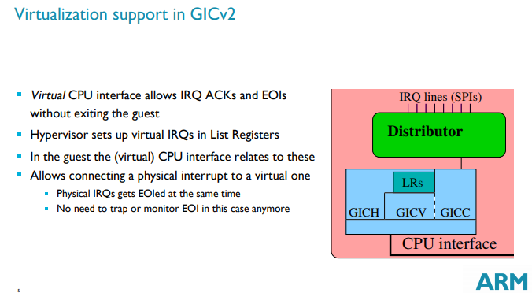
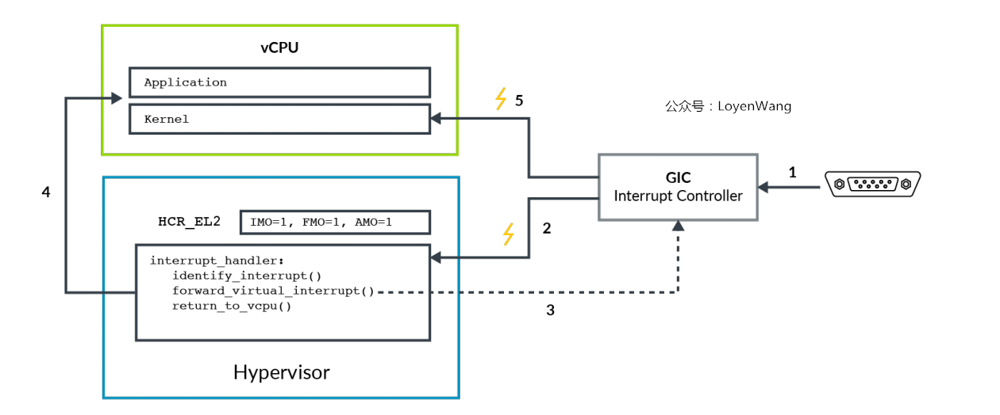
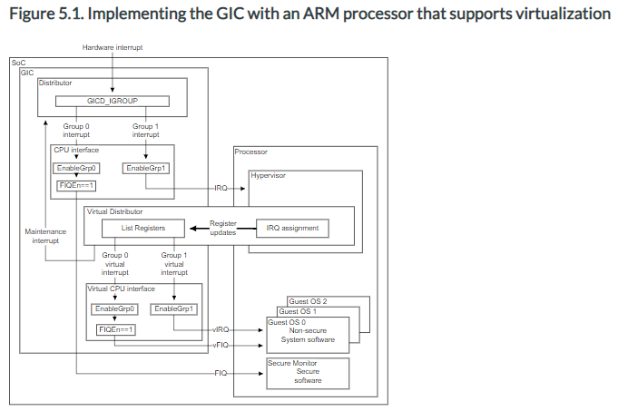

# 2021-08-17 (interrupt virtualization)

http://events17.linuxfoundation.org/sites/events/files/slides/ARM_Interrupt_Virtualization_Przywara.pdf




https://developpaper.com/original-kvm-qemu-analysis-of-linux-virtualization-2-armv8-virtualization/




> 1. Peripheral trigger interrupt signal to GIC;
> 2. GIC generates physical interrupt`IRQ`perhaps`FIQ`Signal, if set`HCR_EL2.IMO/FMO`The interrupt signal will be routed to`Hypervisor`，`Hypervisor`It checks to which interrupt signal is forwarded`vCPU`；
> 3. `Hypervisor`Set GIC to send the physical interrupt signal to a virtual interrupt`vCPU`If the processor is running at EL2, the interrupt signal will be ignored;
> 4. `Hypervisor`Return control to`vCPU`;
> 5. When the processor runs on el0 / el1, the virtual interrupt will be accepted and processed
>
> - The interrupt mask of armv8 processor is controlled by`PSTATE`To control (e.g`PSTATE.I`）In virtualization, the role of bits is somewhat different, such as setting`HCR_EL2.IMO`Indicates that the physical IRQ is routed to EL2 and turned on for el0 / el1`vIRQs`Therefore, when running at el0 / el1,`PSTATE.I`Bits are for virtual`vIRQs`Not physical`pIRQs`。


http://jake.dothome.co.kr/ic/


> #### 2-3) GICH, Virtual CPU Interface Control Registers
>
> - GICH_APR (Active Priorities Register)
> - GICH_EISRn (End of Interrupt Status Registers)
> - GICH_ELRSRn (Empty List Register Status Registers)
> - GICH_HCR (Hypervisor Control Register)
> - GICH_LRn (List Registers)
> - GICH_MISR (Maintenance Interrupt Status Register)
> - GICH_VMCR (Virtual Machine Control Register)
> - GICH_VTR (VGIC Type Register)


https://developer.arm.com/documentation/ddi0471/b/functional-description/functional-overview-of-the-gic-400/virtual-cpu-interfaces-and-virtual-interface-control-registers

CoreLink GIC-400 Generic Interrupt Controller Technical Reference Manual


https://developer.arm.com/documentation/ihi0048/b/GIC-Support-for-Virtualization/About-implementing-a-GIC-in-a-system-with-processor-virtualization

ARM Generic Interrupt Controller Architecture Specification




Q. 가상 인터럽트로 linux kernel에게 전달해준다면, linux kernel에서 gic 레지스터를 접근할 것 같은데, 이때 문제가 없는지? 어떤 식으로 처리되게 되는지?


### SGI 처리 방법

virtual domain 에서 SGI를 보내면 아래의 mmio trap 코드로 진입하게 된다.

// xen/arch/arm/vgic-v2.c

```c
static bool vgic_v2_to_sgi(struct vcpu *v, register_t sgir)
{
    // 생략
    return vgic_to_sgi(v, sgir, sgi_mode, virq, &target);
}

static int vgic_v2_distr_mmio_write(struct vcpu *v, mmio_info_t *info,
                                    register_t r, void *priv)
{
    // 생략
    case VREG32(GICD_SGIR):
        if ( dabt.size != DABT_WORD ) goto bad_width;
        return vgic_v2_to_sgi(v, r);
    // 생략
    return 1;
}

static int vgic_v2_domain_init(struct domain *d)
{
    //생략
    register_mmio_handler(d, &vgic_v2_distr_mmio_handler, d->arch.vgic.dbase,
                          PAGE_SIZE, NULL);

    return 0;
}

static const struct mmio_handler_ops vgic_v2_distr_mmio_handler = {
    .read  = vgic_v2_distr_mmio_read,
    .write = vgic_v2_distr_mmio_write,
};

```

vgic_v2_to_sgi는 다음의 코드로 이어서 진행된다.

// xen/arch/arm/vgic.c

```c
bool vgic_to_sgi(struct vcpu *v, register_t sgir, enum gic_sgi_mode irqmode,
                 int virq, const struct sgi_target *target)
{
    switch ( irqmode )
    {
    case SGI_TARGET_LIST:
        perfc_incr(vgic_sgi_list);
        base = target->aff1 << 4;
        bitmap = target->list;
        for_each_set_bit( i, &bitmap, sizeof(target->list) * 8 )
        {
            vcpuid = base + i;
            if ( vcpuid >= d->max_vcpus || d->vcpu[vcpuid] == NULL ||
                 !is_vcpu_online(d->vcpu[vcpuid]) )
            {
                gprintk(XENLOG_WARNING, "VGIC: write r=%"PRIregister" \
                        target->list=%hx, wrong CPUTargetList \n",
                        sgir, target->list);
                continue;
            }
            vgic_inject_irq(d, d->vcpu[vcpuid], virq, true);
        }
        break;
    // 생략

    return true;
}

```

vgic_inject_irq는 다음의 코드로 이어서 진행된다.

// xen/arch/arm/vgic/vgic.c

```c
void vgic_queue_irq_unlock(struct domain *d, struct vgic_irq *irq,
                           unsigned long flags)
{
    struct vcpu *vcpu;
    // 생략
    vcpu_kick(vcpu);
    return;
}

void vgic_inject_irq(struct domain *d, struct vcpu *vcpu, unsigned int intid,
                     bool level)
{
    // 생략
    vgic_queue_irq_unlock(d, irq, flags);
    return;
}
```

vcpu_kick 함수는 다음과 같다.

// xen/arch/arm/domain.c

```c
void vcpu_kick(struct vcpu *vcpu)
{
    bool running = vcpu->is_running;

    vcpu_unblock(vcpu);
    if ( running && vcpu != current )
    {
        perfc_incr(vcpu_kick);
        smp_send_event_check_mask(cpumask_of(vcpu->processor));
    }
}
```

// xen/arch/arm/smp.c

```c
void smp_send_event_check_mask(const cpumask_t *mask)
{
    send_SGI_mask(mask, GIC_SGI_EVENT_CHECK);
}
```

vcpu_kick 을 하면 domain에서 받아서 처리하게 된다고 한다.

default로 cpu 0 가 sgi를 받아서 pending 하고 vcpu kick으로 보내준다. 

Q. irq를 pending 시키는 코드는?


virtual domain 이 아닌 xen 의 sgi 는 여기로 전달이 된다.

// xen/arch/arm/gic.c

```c
static void do_sgi(struct cpu_user_regs *regs, enum gic_sgi sgi)
{
    struct irq_desc *desc = irq_to_desc(sgi);

    perfc_incr(ipis);

    /* Lower the priority */
    gic_hw_ops->eoi_irq(desc);

    /*
     * Ensure any shared data written by the CPU sending
     * the IPI is read after we've read the ACK register on the GIC.
     * Matches the write barrier in send_SGI_* helpers.
     */
    smp_rmb();

    switch (sgi)
    {
    case GIC_SGI_EVENT_CHECK:
        /* Nothing to do, will check for events on return path */
        break;
    case GIC_SGI_DUMP_STATE:
        dump_execstate(regs);
        break;
    case GIC_SGI_CALL_FUNCTION:
        smp_call_function_interrupt();
        break;
    default:
        panic("Unhandled SGI %d on CPU%d\n", sgi, smp_processor_id());
        break;
    }

    /* Deactivate */
    gic_hw_ops->deactivate_irq(desc);
}


void gic_interrupt(struct cpu_user_regs *regs, int is_fiq)
{
    unsigned int irq;

    do  {
        /* Reading IRQ will ACK it */
        irq = gic_hw_ops->read_irq();

        if ( likely(irq >= 16 && irq < 1020) )
        {
            isb();
            do_IRQ(regs, irq, is_fiq);
        }
        else if ( is_lpi(irq) )
        {
            isb();
            gic_hw_ops->do_LPI(irq);
        }
        else if ( unlikely(irq < 16) )
        {
            do_sgi(regs, irq);
        }
        else
        {
            local_irq_disable();
            break;
        }
    } while (1);
}
```

// xen/common/smp.c

```c
void smp_call_function_interrupt(void)
{
    void (*func)(void *info) = call_data.func;
    void *info = call_data.info;
    unsigned int cpu = smp_processor_id();

    if ( !cpumask_test_cpu(cpu, &call_data.selected) )
        return;

    irq_enter();

    if ( call_data.wait )
    {
        (*func)(info);
        smp_mb();
        cpumask_clear_cpu(cpu, &call_data.selected);
    }
    else
    {
        smp_mb();
        cpumask_clear_cpu(cpu, &call_data.selected);
        (*func)(info);
    }

    irq_exit();
}
```


### IRQ

1. interrupts in kernel dtb for dom0 and domU

   - default dtb interrupts => dom0
   - node with (compatible = "xen, domain") => domU

   ```c
   / {
      domU {
          #address-cells = <2>;
          compatible = "xen, domain";
          
          domu_domain_interrupts@00000000 {
              compatible = "multiboot,module"; // just sample
              interrupt-parent = <&gic>;
              interrputs = <0 0 0>, <0 1 0>, <0 2 0>,
          }
      }
   }
   ```

   위에 dt에 compatible 안에 들어가는 건 skip 되는 것으로 지정하였다.

   // xen/arch/arm/domain_build.c

   ```c
   static int __init handle_node(struct domain *d, struct kernel_info *kinfo,
                                 struct dt_device_node *node,
                                 p2m_type_t p2mt)
   {
       static const struct dt_device_match skip_matches[] __initconst =
       {
           DT_MATCH_COMPATIBLE("xen,xen"),
           DT_MATCH_COMPATIBLE("xen,multiboot-module"),
           DT_MATCH_COMPATIBLE("multiboot,module"),
           DT_MATCH_COMPATIBLE("arm,psci"),
           DT_MATCH_COMPATIBLE("arm,psci-0.2"),
           DT_MATCH_COMPATIBLE("arm,psci-1.0"),
           DT_MATCH_COMPATIBLE("arm,cortex-a7-pmu"),
           DT_MATCH_COMPATIBLE("arm,cortex-a15-pmu"),
           DT_MATCH_COMPATIBLE("arm,cortex-a53-edac"),
           DT_MATCH_COMPATIBLE("arm,armv8-pmuv3"),
           DT_MATCH_PATH("/cpus"),
           DT_MATCH_TYPE("memory"),
           /* The memory mapped timer is not supported by Xen. */
           DT_MATCH_COMPATIBLE("arm,armv7-timer-mem"),
           { /* sentinel */ },
       };
   // 생략
   ```


2. interrupt to each domain

   (in xen boot time, all interrupts from dom0 and domU are saved as guest domain irqs)

   `handle_node -> handle_device -> handle_device_interrupts -> map_irq_to_domain -> route_irq_to_guest`


3. send interrupt to each domain

   `do_trap_irq -> gic_interrupt -> do_IRQ -> vgic_inject_irq`

   do_IRQ 안에 virtual domain 으로 갈 IRQ는 "_IRQ_GUEST" 에 해당해서 vgic_inject_irq() 를 하게 된다. 

   xen 에서 처리하는 interrupt의 경우, action->handler 에서 처리하게 된다.

   

   // xen/arch/arm/irq.c

   ```c
   void do_IRQ(struct cpu_user_regs *regs, unsigned int irq, int is_fiq)
   {
       struct irq_desc *desc = irq_to_desc(irq);
       struct irqaction *action;
   
       perfc_incr(irqs);
       // 생략
       if ( test_bit(_IRQ_GUEST, &desc->status) )
       {
           struct irq_guest *info = irq_get_guest_info(desc);
   
           perfc_incr(guest_irqs);
           desc->handler->end(desc);
   
           set_bit(_IRQ_INPROGRESS, &desc->status);
   
           /*
            * The irq cannot be a PPI, we only support delivery of SPIs to
            * guests.
            */
           vgic_inject_irq(info->d, NULL, info->virq, true);
           goto out_no_end;
       }
       // 생략
       action = desc->action;
   
       spin_unlock_irq(&desc->lock);
   
       do
       {
           action->handler(irq, action->dev_id, regs);
           action = action->next;
       } while ( action );
   
       spin_lock_irq(&desc->lock);
   	// 생략
   }
   ```

   