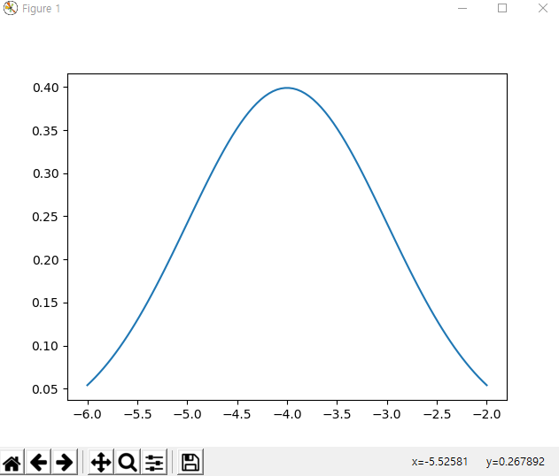

# 2022-01-27 (Python Distribution Plot)

normal distribution 의 PDF (Probability Density Function) 을 그리기 위해 아래와 같이 코드를 작성하였다.

```python
import seaborn as sns
import matplotlib.pyplot as plt
import numpy as np
from scipy.stats import norm

# generate random numbers from N(0,1)
rv = norm(loc=0, scale=1)
xx = np.linspace(-4, 4, 100)
pdf = rv.pdf(xx)
plt.plot(xx, pdf)
plt.show()
```

결과




다른 버전 (이건 데이터를 생성하는 거라 조금 찌그러져 나온다)

```python
import seaborn as sns
import matplotlib.pyplot as plt
from scipy.stats import norm

data_normal = norm.rvs(size=1000000,loc=0,scale=1)
sns.displot(data=data_normal, kind="kde")
plt.show()
```


[참고]

https://stackoverflow.com/questions/33620940/seaborn-plot-doesnt-show-up
https://seaborn.pydata.org/generated/seaborn.displot.html#seaborn.displot
https://www.datacamp.com/community/tutorials/probability-distributions-python
https://m.blog.naver.com/pmw9440/221805677577
https://namyoungkim.github.io/scipy/probability/2017/09/04/scipy/

https://datascienceschool.net/01%20python/01.03%20%ED%8C%8C%EC%9D%B4%EC%8D%AC%20%ED%8C%A8%ED%82%A4%EC%A7%80%20%EC%84%A4%EC%B9%98%ED%95%98%EA%B8%B0.html