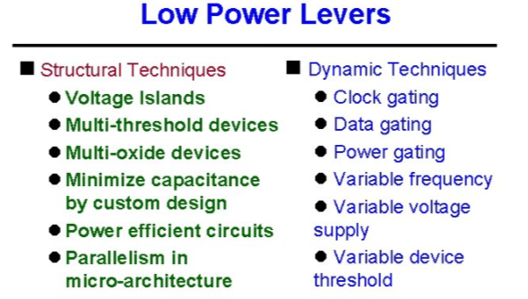
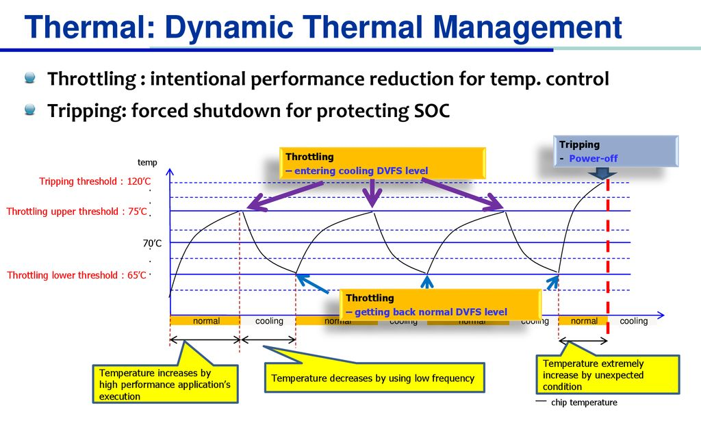
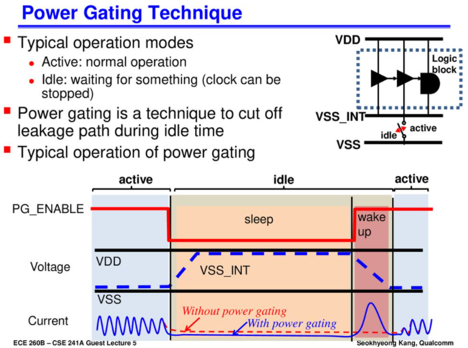
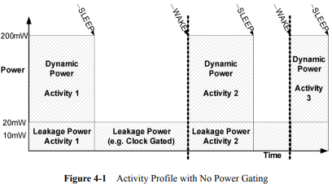

# 2022-03-03 (Power Management Overview)

## 1. Basis of Power Management

### Total Power Consumption 

Total Power Consumption은 Dynamic Power 와 Leakage Power의 합

https://www.quora.com/What-are-the-differences-between-static-and-dynamic-power-consumption-in-CMOS-integrated-circuits-Which-MOSFET-parameters-and-logic-design-considerations-are-most-important-for-static-vs-dynamic-power

Scaling and Power dissipation

Active(Dynamic) power: C x (Vdd)^2 * f

Leakage(Static) power: C x Vdd * I_leak

=> There are 2 solutions to save power

save Active power on run time

save Leakage power on idle time

https://semiengineering.com/as-nodes-advance-so-must-power-analysis/

https://semiengineering.com/knowledge_centers/low-power/low-power-design/power-consumption/

CMOS Scaling changes Power dissipation

Scaling improves Transistor density & functionality on a chip.

Speed and frequency of operation => Higher Performance.

https://www.slideshare.net/sdpable/power-consumption

https://slidetodoc.com/lowpower-ic-design-gating-techniques-tsungchu-huang-dept/ ("Low-Power IC Design Gating Techniques")

※ Component of Power consumption: https://semiengineering.com/knowledge_centers/low-power/low-power-design/power-consumption/

https://www.vlsiguide.com/2020/04/static-and-dynamic-power-dissipation_20.html

## 2. Non-idle power management: adjusting knobs

### 2-1. CPU Frequency Scaling

https://www.sciencedirect.com/topics/computer-science/dynamic-power-dissipation

https://www.usenix.org/legacy/event/hotpower08/tech/full_papers/dhiman/dhiman_html/ ("Analysis of Dynamic Voltage Scaling for System Level Energy Management")

### 2-2. Device level Frequency Scaling

### 2-3. PM-QoS: 이 Linux framework 를 사용해서 위의 2개 driver가 동작함. 위의 2개 driver에는 governor 가 있어서 그게 정책을 결정함.

### 2-4. Thermal Management

https://slidesplayer.org/slide/13749559/ ("Design Methodologies for Advanced Mobile SOCs")

## 3. Idle time power management: switching on/off

### 3-1. CPU Idle

https://www.mdpi.com/2079-9268/2/1/30 ("CASPER: Embedding Power Estimation and Hardware-Controlled Power Management in a Cycle-Accurate Micro-Architecture Simulation Platform for Many-Core Multi-Threading Heterogeneous Processors")

https://pt.slideshare.net/linaroorg/lcu14-210-qualcomm-snapdragon-power-management-unique-challenges-for-power-frameworks/6 ("Qualcomm Snapdragon Power Management")

### 3-2. Removing timer interrupt, interrupt migration

https://www.landley.net/kdocs/ols/2008/ols2008v2-pages-187-198.pdf ("Energy-aware task and interrupt management in Linux")

### 3-3. Clock gating management

### 3-4. Runtime PM (Power Gating)

https://slideplayer.com/slide/14634961 ("Low-Power System-on-Chip Design")

https://link.springer.com/chapter/10.1007/978-0-387-71819-4_4?noAccess=true ("Power Gating Overview")

https://blog.naver.com/PostView.naver?blogId=beahey&logNo=90185364333&parentCategoryNo=&categoryNo=107&viewDate=&isShowPopularPosts=false&from=postView

### 3-5. Suspend to RAM/DISK: system power management

Block Diagram 은 Data sheet 참고 (Jacinto6Eco): https://www.ti.com/product/DRA726

voltage supply 연결 참고(i.MX6ULL Power Consumption Application Note): https://www.nxp.com/docs/en/application-note/AN5345.pdf

오랫동안 사용하지 않아서 핸드폰의 화면이 자동으로 꺼지거나, 노트북의 화면이 꺼졌을 때는 왠만한 부분의 Power 는 꺼져있다.

## 4. Linux Power Feature (framework)

https://lwn.net/Articles/439336/

![[Diagram]](https://static.lwn.net/images/2011/elc-kucheria-diagram.png)

### (1) Static Power

- Suspend To RAM
- Runtime PM
- CPUIDLE: C1, C2, C3
- CPU Hotplug

### (2) Dynamic Power

- Regulator -> PMIC Driver
- Common Clock Framework
- CPUFREQ
- DEVFREQ
- Dynamic Thermal Management

※ CPUIDLE 의 C-State 설명: https://www.dell.com/support/kbdoc/ko-kr/000060621/c-state%EB%8A%94-%EB%AC%B4%EC%97%87%EC%9D%B8%EA%B0%80

https://metebalci.com/blog/a-minimum-complete-tutorial-of-cpu-power-management-c-states-and-p-states/

※ Regulator Framework 의 전체 Overview

https://wiki.st.com/stm32mpu/wiki/Regulator_overview

5. 시나리오별 소모전류