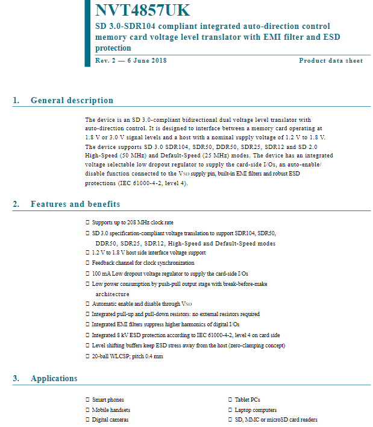
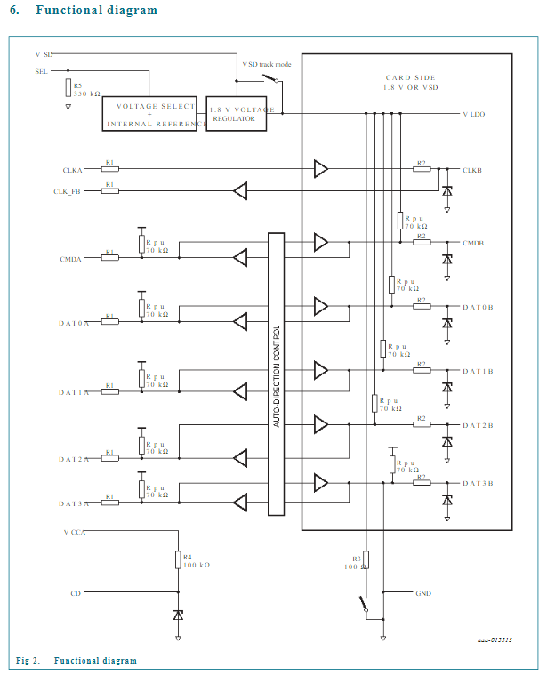
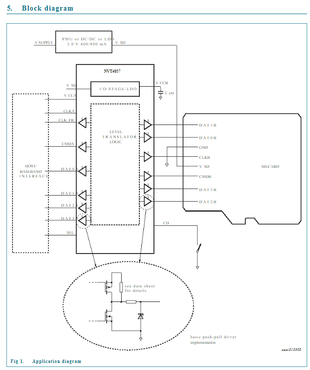

# 2023-06-27 (Level Shifter)

SD Card 에 원하는 속도 (모드) 에 따라 3.0 V 혹은 1.8V 를 인가해야하는데, 이걸 변경할 수 있게 해주는 제품이 NVT4857UK 였다. Datasheet 가 공개되어있어 아래와 같이 확인하였다.

https://html.alldatasheet.com/html-pdf/1255451/NXP/NVT4857UK/64/1/NVT4857UK.html

첫 페이지의 3. Applications 를 보면 SD, MMC or microSD card readers 가 사용처로 적혀있다.

내부를 보면 1.8V regulator 가 들어있고, select 를 하면 3.0V (V_SD) 가 인가되더라도 1.8V regulator 결과 값 (V_LDO)이 출력될 수 있는 것으로 확인된다.

V_SD (3.0V) 가 SD-CARD의 V_SD 로 인가된다. 그리고 LDO 로 voltage를 설정하는 I/O 값들도 SD-CARD 쪽으로 연결되어있는 것을 확인할 수 있다. (DAT 등)

