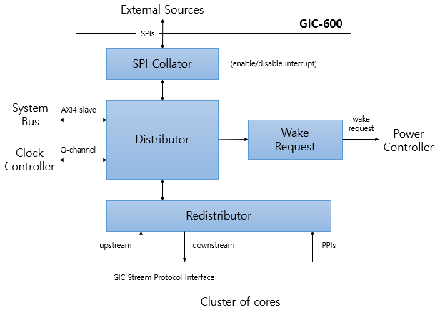

# 2023-07-17 (GIC-600)

### GIC 600

https://developer.arm.com/documentation/100336/0106/introduction/components

https://aijishu.com/a/1060000000210107

### Distributor

https://developer.arm.com/documentation/100336/0106/components-and-configuration/distributor

### Redistributor

https://developer.arm.com/documentation/100336/0106/components-and-configuration/redistributor

### GIC Stream Protocol Interface

https://developer.arm.com/documentation/102143/0001/Components-and-configuration/GIC-Cluster-Interface/GCI-GIC-Stream-Protocol-interface

### SPI Collator

https://developer.arm.com/documentation/101206/0002/Components-and-configuration/SPI-Collator

### GIC 400

https://soclabs.org/technology/gic-400-general-interrupt-controller

### GIC 500

https://soclabs.org/technology/gic-500-general-interrupt-controller