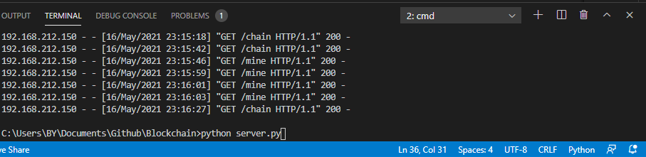
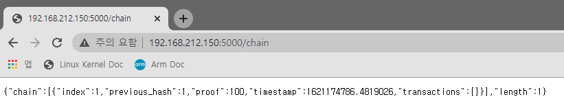
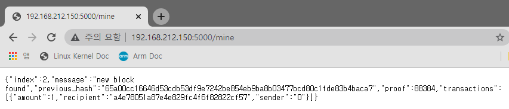
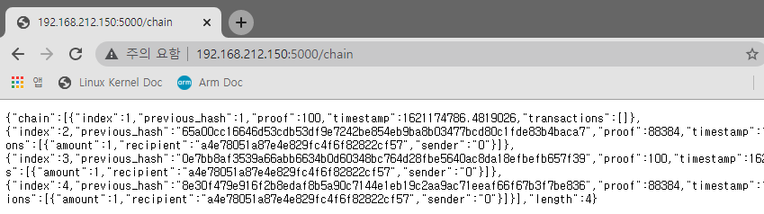
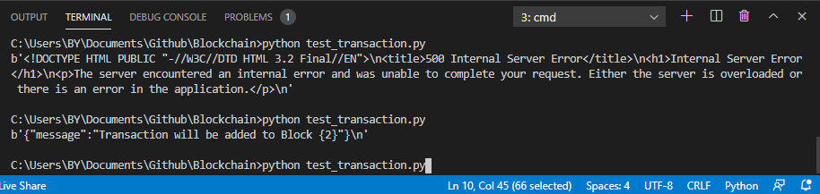
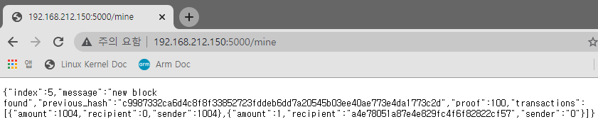

# Blockchain

- 사용한 것들: python, flask, visual studio code
- 유튜브 강의: https://www.youtube.com/watch?v=Gno15LgVbcc
- 소스 코드: https://github.com/tr0y-kim/ez_blockchain/blob/master/blockchain.py

- 작성한 내 결과물: https://github.com/BY1994/Blockchain


## Blockchain 에 필요한 함수 만들기

- init 함수
- new block 생성 함수
- new transaction 생성 함수
- hash 함수
- last_block (이전 블록)

```python
class Blockchain(object):
    def __init__(self):
        self.chain = []
        self.current_transactions = []
    
    def new_block(self):
        # Creates a new Block and adds it to the chain
        pass

    def new_transaction(self):
        # Adds a new transaction to the list of transaction
        pass

    @staticmethod
    def hash(block):
        # Hashes a Block
        pass

    @property
    def last_block(self):
        # Returns the last Block in the chain
        pass
```


## Block 에 들어가는 정보

- index: 몇 번째 블록인지
- Timestamp: 언제 블록이 생성되었는지
- Transaction: 거래 목록
- Proof: 마이닝의 결과
- Prev_hash: 블록의 무결성을 검증하기 위한 것


## 함수 설명

- init 함수: 클래스의 생성자. Block이 만들어지면 가장 먼저 실행되는 함수

  - chain 연결
  - 임시 transaction 저장
  - genesis block 생성

  ```python
      def __init__(self):
          self.chain = [] # chain에 여러 block들 들어옴
          self.current_transaction = [] # 임시 transaction 넣어줌
  
          # genesis block 생성
          self.new_block(previous_hash=1, proof=100)
  ```

  

- new block 생성 함수

  - block 구조 생성
  - chain에 생성된 block 추가

  ```python
      def new_block(self, proof, previous_hash=None):
          # Creates a new Block and adds it to the chain
          block = {
              'index' : len(self.chain)+1,
              'timestamp' : time(), # timestamp from 1970
              'transactions' : self.current_transaction,
              'proof' : proof,
              'previous_hash' : previous_hash or self.hash(self.chain[-1]),
          }
          self.current_transaction = []
          self.chain.append(block)
          return block
  ```

  

- new transaction 함수

  - 새 transaction 생성하고 연결

  ```python
      def new_transaction(self, sender, recipient, amount):
          # Adds a new transaction to the list of transaction
          self.current_transaction.append(
              {
                  'sender' : sender, # 송신자
                  'recipient' : recipient, # 수신자
                  'amount' : amount # 금액
              }
          )
          return self.last_block['index'] + 1
  ```

  

- hash 함수

  - 이미 존재하는 sha256 라이브러리를 사용하면 된다

  ```python
      @staticmethod
      def hash(block):
          # Hashes a Block
          block_string = json.dumps(block, sort_keys=True).encode()
  
          # hash 라이브러리로 sha256 사용
          return hashlib.sha256(block_string).hexdigest()
  ```


- pow 함수

  - valid_proof 함수를 통해 맞을 때까지 반복적으로 검증하면서
  - proof 증가하다가 찾으면 proof 번호 반환

  - 이전 proof p와 현재 구해야할 proof p' 가 있을 때 Hash(p + p') 의 앞 4자리 == "0000" 이 되는 이러한 p'를 구한다.

  ```python
      def pow(self, last_proof):
          proof = 0
          # valid proof 함수를 통해 맞을 때까지 반복적으로 검증
          while self.valid_proof(last_proof, proof) is False:
              proof += 1
  
          return proof
  ```

  

- valid proof 함수

  - 앞의 4자리가 000 으로 시작하는 해시값을 찾는 함수

  ```python
  	@staticmethod
  	def valid_proof(last_proof, proof):
          # 전 proof와 구할 proof 문자열 연결
          guess = str(last_proof + proof).encode()
          # 이 hash 값 저장
          guess_hash = hashlib.sha256(guess).hexdigest()
          # 앞 4자리가 0000 이면 True
          return guess_hash[:4] == "0000" # nonce
  ```


## 서버 구조

- /chain: 현재 블록체인 보여줌
- /transaction/new: 새 트랜잭션 생성
- /mine: server에게 새 블록 채굴 요청


## flask 설치

프롬프트에 다음과 같이 입력하여 설치하였다.

```shell
pip install Flask
```


## 서버 구현

- port 번호는 5000 번으로 할 것이다.

```python
if __name__ == '__main__':
    app.run(host='0.0.0.0', port=5000)
```

- flask 구현은 다음과 같다

```python
app = Flask(__name__)
# Universial Unique Identifier
# 노드 식별을 하기 위해 uuid 함수를 사용!
node_identifier = str(uuid4()).replace('-','')

# 아까 짜놓은 블록체인 객체를 선언
blockchain = Blockchain()
```

- /chain은 다음과 같이 구현한다

```python
@app.route('/chain', methods=['GET'])
def full_chain():
    response = {
        'chain' : blockchain.chain, # 블록체인을 출력
        'length' : len(blockchain.chain), # 블록체인 길이 출력
    }

    return jsonify(response), 200
```

- /transactions/new는 다음과 같이 구현한다

```python
# post는 url에 데이터를 붙여서 보내는 get과 달리 숨겨서 보내는 방식
@app.route('/transactions/new', methods=['POST'])
def new_transaction():
    values = request.get_json() # json 형태를 받아서 저장

    required = ['sender', 'recipient', 'amount'] # 해당 데이터가 존재해야함
    # 데이터가 없으면 에러를 띄움
    if not all(k in values for k in required):
        return 'missing values', 400

    # Create a new Transaction
    # 새 트랜잭션 만들고 삽입
    index = blockchain.new_transaction(values['sender'],values['recipient'],values['amount'])
    response = {'message' : 'Transaction will be added to Block {%s}' % index}

    return jsonify(response), 201
```

- /mine 은 다음과 같이 구현한다.

```python
# 채굴이 되게 할 것
# coinbase transaction: 채굴할 때마다 1 코인씩 준다
@app.route('/mine', methods=['GET'])
def mine():
    last_block = blockchain.last_block
    last_proof = last_block['proof']

    proof = blockchain.pow(last_proof)

    blockchain.new_transaction(
        sender='0', # 채굴시 생성되는 transaction (0 = 운영자)
        recipient=node_identifier, # 지갑 주소처럼 사용
        amount=1 # coinbase transaction
    )
    # Forge the new Block by adding it to the chain
    # 전 블록에 대한 hash를 떠놓고
    previous_hash = blockchain.hash(last_block)
    # 검증하는 걸 넣어서 블록을 새로 생성
    block = blockchain.new_block(proof, previous_hash)

    # block 이 제대로 mine 되었다는 정보를 json 형태로 띄워줌
    response = {
        'message' : 'new block found',
        'index' : block['index'],
        'transactions' : block['transactions'],
        'proof' : block['proof'],
        'previous_hash' : block['previous_hash']
    }

    return jsonify(response), 200
```


## 서버 실행

visual studio code에서 Terminal > New Terminal 선택하고 cmd 로 다음을 실행하였다.

```shell
C:\주소...\Blockchain> python server.py
 * Serving Flask app 'server' (lazy loading)
 * Environment: production
   WARNING: This is a development server. Do not use it in a production deployment.
   Use a production WSGI server instead.
 * Debug mode: off
 * Running on all addresses.
   WARNING: This is a development server. Do not use it in a production deployment.
 * Running on http://192.168.212.150:5000/ (Press CTRL+C to quit)
```

그리고 나온대로 chrome에 입력해서 결과를 보았다.

http://192.168.212.150:5000/chain

```xml
{"chain":[{"index":1,"previous_hash":1,"proof":100,"timestamp":1621172916.6666696,"transactions":[]}],"length":1}
```


post 확인을 위해서 postman 에서 테스트 혹은

테스트 코드를 작성하여 테스트가 가능한데, 테스트 코드 방식으로 해보았다. 아래 라이브러리를 설치한다.

```shell
pip install requests
```

테스트 스크립트

```python
import requests
import json

headers = {'Content-Type' : 'application/json; charset=utf-8'}
data = {
    "sender": 1004,
    "recipient": 0,
    "amount": 1004,
}
print(requests.post("http://localhost:5000/transactions/new", headers=headers, data=json.dumps(data)).content)
```

visual studio code에서 server.py 실행된 상태로 놔두고 terminal을 하나 더 열었다. (하단에 +버튼)

그리고 테스트 스크립트를 실행하였다.

```shell
python test_transaction.py
```


## 결과 확인

visual studio code에서 다음과 같이 server를 실행하였다.



그리고 http://localhost:5000/chain 에 접속하여 block 정보를 확인하였다.



 http://localhost:5000/mine에 접속하여 채굴을 해서 새 block도 얻어보았다. url을 여러 번 쳐서 여러 번 채굴을 하였다.



여러 번 채굴 후 다시 http://localhost:5000/chain  를 치면 다음과 같다.



new transaction 테스트를 다음 스크립트를 실행해서 해보았다.



이거는 url로 바로 결과 확인은 안 되지만 직후에 채굴을 해보면 이전 transaction 결과에 이어 붙여지는 것을 볼 수 있다.

