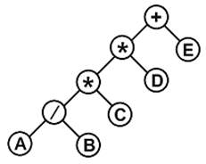
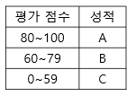

---

---

# Engineer Information Processing Exam (정보처리기사 시험)

## 목차

[2. 소프트웨어 개발 (데이터 입출력 구현)](#2.-소프트웨어-개발-(데이터-입출력-구현))

[2. 소프트웨어 개발 (통합 구현)](#2.-소프트웨어-개발-(통합-구현))

[2. 소프트웨어 개발 (제품 소프트웨어 패키징)](#2.-소프트웨어-개발-(제품-소프트웨어-패키징))

[2. 소프트웨어 개발 (애플리케이션 테스트 관리)](#2.-소프트웨어-개발-(애플리케이션-테스트-관리))

[2. 소프트웨어 개발 (인터페이스 구현)](#2.-소프트웨어-개발-(인터페이스-구현))

## 2. 소프트웨어 개발 (데이터 입출력 구현)

### 자료구조 & 알고리즘

- 리스트, 스택, 큐, 트리, 그래프

> 35. 알고리즘 시간복잡도 O(1) 이 의미하는 것은? 답 (3)
>
>     (1) 컴퓨터 처리가 불가
>
>     (2) 알고리즘 입력 데이터 수가 한 개
>
>     (3) 알고리즘 수행시간이 입력 데이터 수와 관계없이 일정
>
>     (4) 알고리즘 길이가 입력 데이터보다 작음
>
> [출처] 전자문제집 CBT 2020년 6월 6일 필기 기출문제

> 21. 정렬된 N개의 데이터를 처리하는데 O(Nlog_2 N) 의 시간이 소요되는 정렬 알고리즘은? 답 (4)
>
>     (1) 선택정렬 (2) 삽입정렬 (3) 버블정렬 (4) 합병정렬
>
> [출처] 전자문제집 CBT 2020년 6월 6일 필기 기출문제

> 31. 다음 트리의 차수 (degree) 와 단말 노드 (terminal node) 의 수는? 답 (2)
>
>     
>
>     (1) 차수: 4, 단말 노드: 4
>
>     (2) 차수: 2, 단말 노드: 4
>
>     (3) 차수: 4, 단말 노드: 8
>
>     (4) 차수: 2, 단말 노드: 8
>
> [출처] 전자문제집 CBT 2020년 6월 6일 필기 기출문제

### 트리의 순회 방법

- 중위 순회 : 왼쪽 서브트리 -> 중간 노드 -> 오른쪽 서브트리
- 전위 순회 : 중간 노드 -> 왼쪽 서브트리 -> 오른쪽 서브트리
- 후위 순회 : 왼쪽 서브트리 -> 오른쪽 서브트리 -> 중간 노드

> 26. 다음 트리를 전위 순회 (preorder traversal) 한 결과는? 답 (4)
>
>     
>
>     (1) +\*AB/\*CBE 
>
>     (2) AB/C\*D\*E+ 
>
>     (3) A/B\*C\*D+E
>
>     (4) +\*\*/ABCDE
>
> [출처] 전자문제집 CBT 2020년 6월 6일 필기 기출문제
>
> [그림 출처] https://q.fran.kr/%EB%AC%B8%EC%A0%9C/3664

### 그래프

- 무방향, 방향 그래프

### 데이터 베이스

- 데이터베이스 특징

- DBMS 장단점

### 스키마

- 정의
- 외부 스키마
- 개념 스키마
- 내부 스키마

### 데이터 베이스 설계

- 요구조건 분석
- 개념적 설계
- 논리적 설계
- 물리적 설계
- 데이터베이스 구현

### SQL

- DDL
- DML
- DCL

데이터 접속 (ORM), 트랜잭션

절차형 SQL 프로시저, 트리거, 사용자 정의함수

## 2. 소프트웨어 개발 (통합 구현)

### 단위 모듈

- 디바이스 드라이버
- 네트워크
- 파일
- 메모리
- 프로세스

### 단위 모듈 테스트

- 화이트 박스, 블랙 박스 테스트
- 테스트 케이스

White Box Testing 종류: Condition Testing, Loop Testing, Data Flow Testing

Black Box Testing 종류: Equivalence Partitioning Testing, Boundary Value Testing, Cause-Effect Graphic Testing, Error Guessing, Comparison Testing

> 22. White Box Testing에 대한 설명으로 옳지 않은 것은? 답 (1)
>
>     (1) Base Path Testing, Boundary Value Analysis 가 대표적인 기법이다.
>
>     (2) Source Code의 모든 문장을 한번 이상 수행함으로서 진행된다.
>
>     (3) 모듈 안의 작동을 직접 관찰할 수 있다.
>
>     (4) 산출물의 각 기능별로 적절한 프로그램의 제어구조에 따라 선택, 반복 등의 부분들을 수행함으로써 논리적 경로를 점검한다.
>
> [출처] 전자문제집 CBT 2020년 6월 6일 필기 기출문제

### 개발 지원 도구

- IDE
- 빌드도구
- 협업 도구

## 2. 소프트웨어 개발 (제품 소프트웨어 패키징)

### 소프트웨어 패키징

> 39. SW 패키징 도구 활용시 고려사항과 거리가 먼 것은? 답 (3)
>
>     (1) 패키징 시 사용자에게 배포되는 SW이므로 보안을 고려한다.
>
>     (2) 사용자 편의성을 위한 복합성 및 비효율성 문제를 고려한다.
>
>     (3) 보안상 단일 기종에서만 사용할 수 있도록 해야 한다.
>
>     (4) 제품 SW 종류에 적합한 암호화 알고리즘을 적용한다.
>
> [출처] 전자문제집 CBT 2020년 6월 6일 필기 기출문제

### 릴리즈 노트

### 디지털 저작권 관리

- 클리어링 하우스, 콘텐츠 분배자, DRM 컨트롤러, 보안 컨테이너
- 디지털 저작권 관리의 기술 요소

> 32. 디지털 저작권 관리 (DRM) 의 기술 요소가 아닌 것은? 답 (4)
>
>     (1) 크랙 방지 기술 (2) 정책 관리 기술 (3) 암호화 기술 (4) 방화벽 기술
>
> [출처] 전자문제집 CBT 2020년 6월 6일 필기 기출문제

### 소프트웨어 설치 메뉴얼

### 소프트웨어 사용자 메뉴얼

### 국제 표준 제품 품질

- ISO/IEC 12119 등

> 23. 소프트웨어 품질 측정을 위해 개발자 관점에서 고려해야할 항목으로 거리가 먼 것은? 답 (4)
>
>     (1) 정확성 (2) 무결성 (3) 사용성 (4) 간결성
>
> [출처] 전자문제집 CBT 2020 년 6월 6일 필기 기출문제

### 소프트웨어 버전 등록

- 형상 관리

소프트웨어 버전관리 도구

> 34. 소프트웨어 형상 관리의 의미로 적절한 것은? 답 (2)
>
>     (1) 비용에 관한 사항을 효율적으로 관리하는 것
>
>     (2) 개발 과정의 변경 사항을 관리하는 것
>
>     (3) 테스트 과정에서 소프트웨어를 통합하는 것
>
>     (4) 개발 인력을 관리하는 것
>
> [출처] 전자문제집 CBT 2020년 6월 6일 필기 기출문제

### 빌드 자동화 도구

- 젠킨스
- 그래들

## 2. 소프트웨어 개발 (애플리케이션 테스트 관리)

### 애플리케이션 테스트

- 정적, 동적 테스트
- 명세, 구조, 경험 기반
- 검증, 확인 테스트
- 회복, 안전, 강도, 성능, 구조, 회귀 테스트

> 33. 소프트웨어 테스트에서 오류의 80%는 전체 모듈의 20% 내에서 발견된다는 법칙은?
>
>     (1) Brooks 의 법칙 (2) Boehm의 법칙 (3) Pareto 의 법칙 (4) Jackson의 법칙

### 테스트 기법에 따른 애플리케이션 테스트

- 화이트박스, 블랙박스 테스트

> 28. 평가 점수에 따른 성적부여는 다음 표와 같다. 이를 구현한 소프트웨어를 경계값 분석 기법으로 테스트하고자 할 때 다음 중 테스트 케이스의 입력 값으로 옳지 않은 것은? 답 (3)
>
>     
>
>     (1) 59 (2) 80 (3) 90 (4) 101

### 개발 단계에 따른 애플리케이션 테스트

- 단위 테스트
- 통합 테스트
- 검증 테스트: 형상, 알파, 베타
- 시스템 테스트: 복구, 보안, 강도, 성능

> 37. 검증 검사 기법 중 개발자의 장소에서 사용자가 개발자 앞에서 행하는 기법이며, 일반적으로 통제된 환경에서 사용자와 개발자가 함께 확인하면서 수행되는 검사는? 답 (3)
>
>     (1) 동치 분할 검사 (2) 형상 검사 (3) 알파 검사 (4) 베타 검사
>
> [출처] 전자문제집 CBT 2020년 6월 6일 필기 기출문제

> 38. 하향식 통합에 있어서 모듈 간의 통합 시험을 위해 일시적으로 필요한 조건만을 가지고 임시로 제공되는 시험용 모듈을 무엇이라고 하는가?
>
>     (1) Stub (2) Driver (3) Procedure (4) Function
>
> [출처 ] 전자문제집 CBT 2020년 6월 6일 필기 기출문제

### 애플리케이션 테스트 프로세스

### 테스트 케이스 / 테스트 시나리오 / 테스트 오라클

### 테스트 자동화 도구

> 24. 인터페이스 구현 검증도구 중 아래에서 설명하는 것은? 답 (2)
>
>     - 서비스 호출, 컴포넌트 재사용 등 다양한 환경을 지원하는 테스트 프레임워크
>     - 각 테스트 대상 분산 환경에 데몬을 사용하여 테스트 대상 프로그램을 통해 테스트를 수행하고, 통합하여 자동화하는 검증 도구
>
>     (1) xUnit (2) STAF (3) FitNesse (4) RubyNode
>
> [출처] 전자문제집 CBT 2020년 6월 6일 필기 기출문제

### 결함 관리

### 애플리케이션 성능 분석

- 처리량, 응답시간, 경과시간, 자원 사용률

### 애플리케이션 성능 개선

- 소스코드 최적화 (클린 코드, 나쁜 코드)
- 소스코드 품질 분석 도구: pmd, cppcheck, checkstyle, ccm, avalanche, valgrind

> 36. 소스코드 품질분석 도구 중 정적분석 도구가 아닌 것은? 답 (3)
>
>     (1) pmd (2) cppcheck (3) valMeter (4) checkstyle
>
> [출처] 전자문제집 CBT 2020년 6월 6일 필기 기출문제

> 40. 외계인코드 (Alien Code) 에 대한 설명으로 옳은 것은? 답 (2)
>
>     (1) 프로그램의 로직이 복잡하여 이해하기 어려운 프로그램을 의미한다.
>
>     (2) 아주 오래되거나 참고문서 또는 개발자가 없어 유지보수 작업이 어려운 프로그램을 의미한다.
>
>     (3) 오류가 없어 디버깅 과정이 필요 없는 프로그램을 의미한다.
>
>     (4) 사용자가 직접 작성한 프로그램을 의미한다.
>
> [출처] 전자문제집 CBT 2020년 6월 6일 필기 기출문제

## 2. 소프트웨어 개발 (인터페이스 구현)

### EAI (Enterprise Application Integration)

- EAI는 기업 내 각종 애플리케이션 및 플랫폼 간의 정보 전달, 연계 통합 등 상호 연동이 가능하게 해주는 솔루션이다.

> 25. EAI (Enterprise Application Integration) 의 구축 유형으로 옳지 않은 것은? 답 (4)
>
>     (1) Point-to-Point (2) Hub&Spoke (3) Message Bus (4) Tree
>
> [출처] 전자문제집 CBT 2020년 6월 6일 필기 기출문제

### 인터페이스 보안

> 27. 인터페이스 보안을 위해 네트워크 영역에 적용될 수 있는 솔루션과 거리가 먼 것은? 답 (2)
>
>     (1) IPSec (2) SMTP (3) SSL (4) S-HTTP
>
> [출처] 전자문제집 CBT 2020년 6월 6일 필기 기출문제

## 참고 자료

- 정보처리기사 필기 요약정리: https://shlee1990.tistory.com/category/%EC%9E%90%EA%B8%B0%EA%B3%84%EB%B0%9C/%EC%9E%90%EA%B2%A9%EC%A6%9D
- 정보처리기사 필기 요약 더 자세한 정리: https://narup.tistory.com/72
- 정보처리기사 필기 전자문제집 CBT: https://www.comcbt.com/xe/iz

