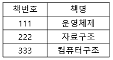
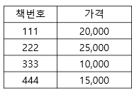

# Engineer Information Processing Exam (정보처리기사 시험)

## 목차

[3. 데이터베이스 (논리 데이터베이스 설계)](#3.-데이터베이스-(논리-데이터베이스-설계))

[3. 데이터베이스 (물리 데이터베이스 설계)](#3.-데이터베이스-(물리-데이터베이스-설계))

[3. 데이터베이스 (SQL 응용)](#3.-데이터베이스-(SQL-응용))

[3. 데이터베이스 (SQL 활용)](#3.-데이터베이스-(SQL-활용))

[3. 데이터베이스 (데이터 전환)](#3.-데이터베이스-(데이터-전환))

## 3. 데이터베이스 (논리 데이터베이스 설계)

### 데이터베이스 설계

- 요구조건 분석, 개념적 설계, 논리적 설계, 물리적 설계, 구현

- 논리적 설계: 논리적 스키마 설계, 트랜잭션 인터페이스 설계, 테이블 설계, 스키마의 평가 및 정제
- 물리적 설계: 데이터베이스 파일 저장 구조 및 액세스 경로 결정, 레코드 집중의 분석 및 설계

> 46. 데이터베이스의 논리적 설계 (logical design) 단계에서 수행하는 작업이 아닌 것은? 답 (1)
>
>     (1) 레코드 집중의 분석 및 설계
>
>     (2) 논리적 데이터베이스 구조로 매핑 (mapping)
>
>     (3) 트랜잭션 인터페이스 설계
>
>     (4) 스키마의 평가 및 정제
>
> [출처] 전자문제집 CBT 2020년 6월 6일 필기 기출문제

### 데이터 모델

- 개체
- 속성
- 관계

### 식별자

### E-R (개체-관계) 모델

- 사각형: 개체 (Entity)
- 마름모: 관계 (Relationship)
- 타원: 속성 (Attribute)
- 선: 연결

> 58. E-R 모델의 표현 방법으로 옳지 않은 것은? 답 (3)
>
>     (1) 개체타입: 사각형 (2) 관계타입: 마름모 
>
>     (3) 속성: 오각형 (4) 연결: 선
>
> [출처] 전자문제집 CBT 2020년 6월 6일 필기 기출문제

### 관계형 데이터베이스

- 튜플
- 속성
- 도메인

릴레이션

> 48. 하나의 애트리뷰트가 가질 수 있는 원자값들의 집합을 의미하는 것은? 답 (1)
>
>     (1) 도메인 (2) 튜플 (3) 엔티티 (4) 다형성
>
> [출처] 전자문제집 CBT 2020년 6월 6일 필기 기출문제

### 관계형 데이터베이스의 제약 조건 - 키 (Key)

- 후보키
- 기본키
- 대체키
- 슈퍼키
- 외래키

> 59. 다음 설명의 () 안에 들어갈 내용으로 적합한 것은? 답 (2)
>
>     - 후보키는 릴레이션에 있는 모든 튜플에 대해 유일성과 (   ) 을 모두 만족시켜야 한다.
>
>     (1) 중복성 (2) 최소성 (3) 참조성 (4) 동일성
>
> [출처] 전자문제집 CBT 2020년 6월 6일 필기 기출문제

> 42. 다음 두 릴레이션에서 외래키로 사용된 것은? (단, 밑줄친 속성은 기본키이다) 답 (2)
>
>     - 과목(<u>과목번호</u>, 과목명)
>     - 수강(<u>수강번호</u>, 학번, 과목번호, 학기)
>
>     (1) 수강번호 (2) 과목번호 (3) 학번 (4) 과목명
>
> [출처] 전자문제집 CBT 2020년 6월 6일 필기 기출문제

### 관계형 데이터베이스의 제약 조건 - 무결성

- 개체 무결성
- 도메인 무결성
- 참조 무결성
- 사용자 정의 무결성

> 43. 데이터 무결성 제약조건 중 "개체 무결성 제약" 조건에 대한 설명으로 맞는 것은? 답 (2)
>
>     (1) 릴레이션 내의 튜플들이 각 속성의 도메인에 지정된 값만을 가져야 한다.
>
>     (2) 기본키에 속해있는 애트리뷰트는 널값이나 중복값을 가질 수 없다.
>
>     (3) 릴레이션은 참조할 수 없는 외래키 값을 가질 수 없다.
>
>     (4) 외래키 값은 참조 릴레이션의 기본키 값과 동일해야한다.
>
> [출처] 전자문제집 CBT 2020년 6월 6일 필기 기출문제

### 관계대수

- 셀렉트
- 프로젝트
- 조인
- 디비전

혹은 https://bazingzinga.blogspot.com/2019/02/9.html 표 참고

> 50. 관계대수 연산에서 두 릴레이션이 공통으로 가지고 있는 속성을 이용하여 두 개의 릴레이션을 하나로 합쳐서 새로운 릴레이션을 만드는 연산은? 답 (1)
>
>     (1) 
>
>     (2)  ⊃
>
>     (3)  π
>
>     (4)  σ
>
> [출처] 전자문제집 CBT 2020년 6월 6일 필기 기출문제

### 정규화

- 1NF 조건: 원자값으로 구성
- 2NF 조건: 부분 함수 종속 제거 (완전 함수적 종속 관계)
- 3NF 조건: 이행 함수 종속 제거
- BCNF 조건: 결정자 함수 종속
- 4NF 조건: 다중값 (다치) 종속성 제거
- 5NF 조건: 조인 종속성 제거

> 60. 정규화 과정 중 1NF가 2NF 가 되기 위한 조건은? 답 (4)
>
>     (1) 1NF를 만족하는 모든 도메인이 원자값이어야한다.
>
>     (2) 1NF를 만족하고 키가 아닌 모든 애트리뷰트들이 기본키에 이행적으로 함수 종속되지 않아야 한다.
>
>     (3) 1NF를 만족하고 다치 종속이 제거되어야 한다.
>
>     (4) 1NF를 만족하고 키가 아닌 모든 속성이 기본키에 대하여 완전 함수적 종속 관계를 만족해야 한다.
>
> [출처] 전자문제집 CBT 2020년 6월 6일 필기 기출문제

> 47. 이행적 함수 종속 관계를 의미하는 것은? 답 (1)(1) A->B이고 B->C일 때, A->C를 만족하는 관계
>
>     (2) A->B이고 B->C일 때, C->A를 만족하는 관계
>
>     (3) A->B이고 B->C일 때, B->A를 만족하는 관계
>
>     (4) A->B이고 B->C일 때, C->B를 만족하는 관계
>
> [출처] 전자문제집 CBT 2020년 6월 6일 필기 기출문제

### 반정규화

- 테이블 통합
- 테이블 분할
- 중복 테이블 추가
- 중복 속성 추가

## 3. 데이터베이스 (물리 데이터베이스 설계)

### 데이터베이스 저장 공간 설계

- 테이블

### 트랜잭션 분석 / CRUD 분석

- 원자성, 일관성, 독립성, 영속성

> 51. 트랜잭션의 특성 중 다음 설명에 해당하는 것은? 답 (4)
>
>     - 트랜잭션의 연산은 데이터베이스에 모두 반영되든지 아니면 전혀 반영되지 않아야한다.
>
>     (1) Durability (2) Share (3) Consistency (4) Atomocity
>
> [출처] 전자문제집 CBT 2020년 6월 6일 필기 기출문제

### 병행제어 기법 로킹 (Locking)

- 트랜잭션이 접근하고자 하는 데이터를 잠가 (lock) 다른 트랜잭션이 접근하지 못하도록 하는 병행 제어 기법이다. [출처] https://devinus.tistory.com/25
- 로킹 단위 ↑ : 로크 수 ↓, 병행성 ↓, 오버헤드↓, 공유도↓, 제어기법 간단하여 관리 수월 (다 내려간다고 외우면 된다)
- 로킹 단위 ↓ : 로크 수 ↑, 병행성 ↑, 오버헤드↑, 공유도↑, 제어기법 까다로워 관리 복잡

> 57. 병행제어의 로킹 (Locking) 단위에 대한 설명으로 옳지 않은 것은? 답 (2)
>
>     (1) 데이터베이스, 파일, 레코드 등은 로킹 단위가 될 수 있다.
>
>     (2) 로킹 단위가 작아지면 로킹 오버헤드가 감소한다.
>
>     (3) 로킹 단위가 작아지면 데이터베이스 공유도가 증가한다.
>
>     (4) 한꺼번에 로깅할 수 있는 객체의 크기를 로킹 단위라고 한다.
>
> [출처] 전자문제집 CBT 2020년 6월 6일 필기 기출문제

### 인덱스 설계

### 뷰의 설계

> 44. 뷰(view) 에 대한 설명으로 옳지 않은 것은? 답 (4)
>
>     (1) 뷰는 CREATE 문을 사용하여 정의한다.
>
>     (2) 뷰는 데이터의 논리적 독립성을 제공한다.
>
>     (3) 뷰를 제거할 때는 DROP 문을 사용한다.
>
>     (4) 뷰는 저장장치 내에 물리적으로 존재한다.
>
> [출처] 전자문제집 CBT 2020년 6월 6일 필기 기출문제

### 클러스터 설계

### 분산 데이터베이스 설계

- 위치 투명성, 중복 투명성, 병행 투명성, 장애 투명성

> 52. 분산 데이터베이스 목표 중 "데이터베이스의 분산된 물리적 환경에서 특정 지역의 컴퓨터 시스템이나 네트워크에 장애가 발생해도 데이터 무결성이 보장된다"는 것과 관계있는 것은? 답 (1)
>
>     (1) 장애 투명성 (2) 병행 투명성 (3) 위치 투명성 (4) 중복 투명성
>
> [출처] 전자문제집 CBT 2020년 6월 6일 필기 기출문제

### 데이터베이스 보안/암호화

### 데이터베이스 보안 - 접근통제

### 데이터베이스 백업

### 스토리지

- DAS, NAS, SAN

## 3. 데이터베이스 (SQL 응용)

### DDL

- CREATE
- ALTER
- DROP

> 41. SQL 의 분류 중 DDL에 해당하지 않는 것은? 답 (1)
>
>     (1) UPDATE (2) ALTER (3) DROP (4) CREATE
>
> [출처] 전자문제집 CBT 2020년 6월 6일 필기 기출문제

> 54. 참조 무결성을 유지하기 위하여 DROP 문에서 부모 테이블의 항목 값을 삭제할 경우 자동적으로 자식 테이블의 해당 레코드를 삭제하기 위한 옵션은? 답 (2)
>
>     (1) CLUSTER (2) CASCADE (3) SET-NULL (4) RESTRICTED
>
> [출처] 전자문제집 CBT 2020년 6월 6일 필기 기출문제

### DML

- SELECT, INSERT, DELETE, UPDATE

> 55. DML에 해당하는 SQL 명령으로만 나열된 것은? 답 (3)
>
>     (1) DELETE, UPDATE, CREATE, ALTER
>
>     (2) INSERT, DELETE, UPDATE, DROP
>
>     (3) SELECT, INSERT, DELETE, UPDATE
>
>     (4) SELECT, INSERT, DELETE, ALTER
>
> [출처] 전자문제집 CBT 2020년 6월 6일 필기 기출문제

> 49. STUDENT 테이블에 독일어과 학생 50명, 중국어과 학생 30명, 영어영문학과 학생 50명의 정보가 저장되어 있을 때, 다음 두 SQL 문의 실행 결과 튜플 수는? (단, DEPT 컬럼은 학과명) 답 (3)
>
>     - (a) SELECT DEPT FROM STUDENT;
>     - (b) SELECT DISTINCT DEPT FROM STUDENT;
>
>     (1) (a) 3, (b) 3
>
>     (2) (a) 50, (b) 3
>
>     (3) (a) 130, (b) 3
>
>     (4) (a) 130, (b) 130
>
> [출처] 전자문제집 CBT 2020년 6월 6일 필기 기출문제

> 45. 다음 SQL 문의 실행 결과는? 답 (4)
>
>     SELECT 가격 FROM 도서가격
>
>      WHERE 책번호 = (SELECT 책번호
>
>     ​	FROM 도서 WHERE 책명='자료구조');
>
>     [도서]
>
>     
>
>     [도서가격]
>
>     
>
>     (1) 10,000 (2) 15,000 (3) 20,000 (4) 25,000
>
> [출처] 전자문제집 CBT 2020년 6월 6일 필기 기출문제

### DCL

> 56. 데이터 제어언어 (DCL) 의 기능으로 옳지 않은 것은? 답 (2)
>
>     (1) 데이터 보안
>
>     (2) 논리적, 물리적 데이터 구조 정의
>
>     (3) 무결성 유지
>
>     (4) 병행수행 제어
>
> [출처] 전자문제집 CBT 2020년 6월 6일 필기 기출문제

## 3. 데이터베이스 (SQL 활용)

### 프로시저

### 트리거

> 53. 데이터베이스 시스템에서 삽입, 갱신, 삭제 등의 이벤트가 발생할 때마다 관련 작업이 자동으로 수행되는 절차형 SQL은? 답 (1)
>
>     (1) 트리거 (trigger) (2) 무결성 (integrity) (3) 잠금 (lock) (4) 복귀 (rollback)
>
> [출처] 전자문제집 CBT 2020년 6월 6일 필기 기출문제

### 사용자 정의 함수

### ORM

## 3. 데이터베이스 (데이터 전환)

### 데이터 전환 계획서

### 데이터 검증

### 오류 데이터 측정 및 정제

### 데이터 정제 요청서

## 참고 자료

- 정보처리기사 필기 요약정리: https://shlee1990.tistory.com/category/%EC%9E%90%EA%B8%B0%EA%B3%84%EB%B0%9C/%EC%9E%90%EA%B2%A9%EC%A6%9D
- 정보처리기사 필기 요약 더 자세한 정리: https://narup.tistory.com/72
- 정보처리기사 필기 전자문제집 CBT: https://www.comcbt.com/xe/iz

